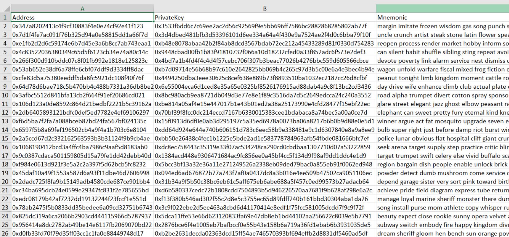

- [link](https://cointool.app/dashboard)

CoinTool позволяет автоматически создавать множесто кошельков в различных сетях - пользователю остается лишь импортировать их.

Создние кошельков происходит следующим образом:
1. На [сайте](https://cointool.app/dashboard) переходим во вкладку *Batch Wallet Generate*.
2. Выбираем желаемую сеть из выпадающего списка.
3. Вписываем число кошельков и запускаем процесс создания кошельков.
4. Экспортируем кошельки нажатием кнопки *Export* и получаем подобную таблицу:
