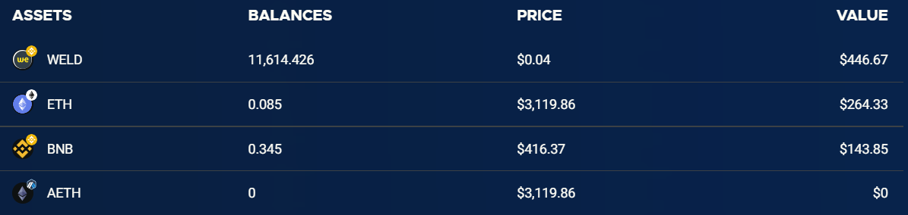
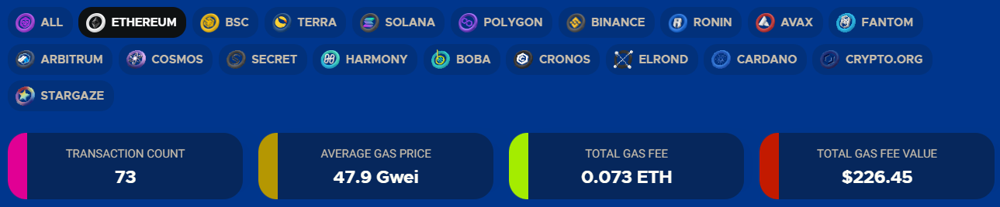
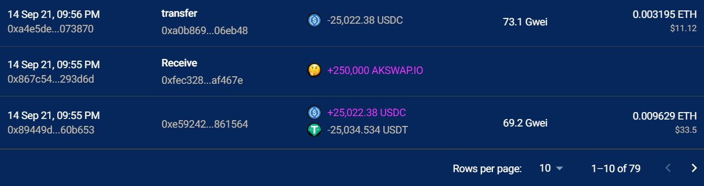
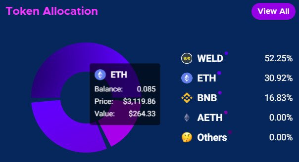

-> [link](https://apeboard.finance/dashboard)

Сети: ETH, BSC, SOL, Terra, Polygon, Ronin, AVAX, FTM, ARBI, COSMOS, Harmony, Boba, Cronos
Трекает NFT: Да (ETH, Terra)
Трекает DeFi: Да (BSC)

Сервис, показывающий такие состояния кошелька, как: 
- Блендер монеток на BSC. Можно отправить разные коины одной транзой, обменяв на одну.
- Многоступенчатый агрегатор мостов. Ищет пути через разные сетки, показывая комисcии и время ожидания. 
- балансы монет в различных сетях

- потраченная комиссия

- история транзакций

- различная аналитика

аналог: [zapper.fi](https://zapper.fi/dashboard)