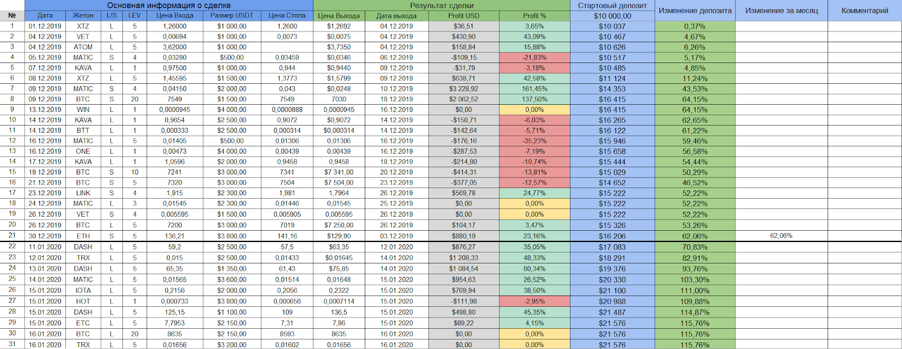

# Ведение статистики
-> Ссылка на оригинал отсутствует

---

Любой трейдер обязан вести статистику, чтобы понимать в каких моментах он допускает ошибки. Статистика помогает находить ошибки и пресекать их. Трейдинг это про гонку с самим собой на дистанции, важно становиться лучше самого себя вчера, неделю, месяц, год назад. Более 90% игроков на рынке торгуют стабильно в минус, поэтому здесь нужно равняться только на себя самого, а как это сделать, если даже нельзя посмотреть на себя в прошлом? Только статистика – писать детали сделки (почему вошел, цена входа, стопа, выхода, тейков) и комментарии к каждой сделке, будь она профитной или убыточной. Ведь зачастую весь профит на сделке никто не высиживает, над этим тоже нужно работать.

Я в материалах к этому уроку добавлю таблицу ексель, в которую нужно вносить все свои трейды и описывать их, это обязательно. Также, вы можете создавать свой журнал, как вам удобно. Таблица будет наша с 2ТОП, чтобы наглядно понять, как она работает, удалить все, что в белых ячейках и она будет чисто!

Вносить данные только в белые ячейки, остальное таблица считает самостоятельно.

Помним, что в екселе нельзя ставить точки, типа 0.15, нужно ставить запятые, типа 0,15.

И да, внизу есть 2 листа, первый - стата, второй - калькулятор.