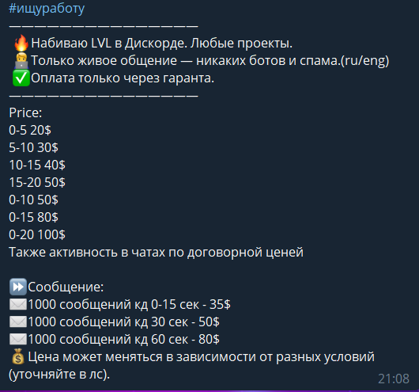
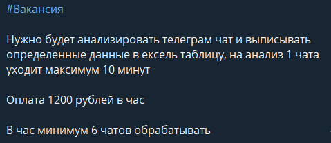

# Методичка по Наёму работников
- [Оригинальная статья](https://telegra.ph/Metodichka-po-Nayomu-rabotnikov-02-28)
---

## Введение
Что же представляет из себя чат [Наём работников](https://t.me/naem_rektovalshik)? Это место, где вы можете найти работу или работников в сфере криптовалют.  

Чем вам можем быть полезен данный чат? Криптаны, пока что не имеющие крупного капитала, могут начать зарабатывать без каких-либо вложений, найдя работу в чате, и, возможно, даже набраться какого-то опыта в криптосфере во время выполнения заказов. В то же время люди с крупным капиталом могут делигировать часть рутинных дел на кого-либо другого, тем самым освободя время на решение каких-либо более важных вопросов.

Я сразу хочу предупредить, что как доверять какую-то важную работу незнакомцу, так и доверять своё время для работы на кого-то может быть достаточно рискованно. Если вы наймёте работника, например, для рисования артов, а он ввиду каких-либо обстоятельств не успеет нарисовать его до дедлайна выдачи вайтлистов в проекте, то вы можете потерять тысячи долларов потенциальной прибыли. Или если вы устроитесь к кому-то работать, но не воспользуйтесь услугами гаранта при заключении сделки, то, выполнив заказ, вы можете получить блокировку в личных сообщениях от работодателя и уйму потраченного впустую времени.  

Итак, я думаю, что стоит уже приступить к основному содержанию методички.  

## Публикация объявлений в чате
Так как в чате публикуют объявления как работодатели, так и работники, то мы ввели два типа шаблонов написания объявлений:

1. Для работников: в начале объявления пишите хештег #ищуработу. Объявление должно содержать информацию об услугах, которые вы предоставляете, и цены на них. По возможности стоит добавить информацию о вашем опыте работы. Примеры правильно оформлённых объявлений:

2. Для работодателей: в начале объявления пишите хештег #вакансия. Объявление должно содержать краткую информацию о вакансии и какую оплату вы готовы предложить за данный заказ. Примеры правильно оформлённых объявлений:

  

Для предотвращения спама в чате введено ограничение на отправку только одного сообщения в час.  

## Работа с гарантами
Многие новички не знают, кто такой гарант и зачем он нужен, из-за чего часто попадают в очень неприятные ситуации во время проведения сделок.

Гарант -  это незаинтересованное лицо, которое участвует в финансовых и правовых сделках за вознаграждение. Он контролирует, чтобы стороны соблюдали условия сделки и выполняли обязательства. 

При заключении сделок с незнакомыми людьми в интернете обязательно нужно использовать услуги гаранта, так как без них в девяти из десяти случаев вас обманут на деньги/потраченное на работу время.

А теперь перейдём к тому, как заключать сделки при помощи гарантов:
1. Когда вы нашли работника/работодателя, предложите ему работать с гарантом. Чаще всего добросовестные работники/работодатели соглашаются на это.
2. Найдите закреплённое сообщение в чате и кликните на юзернейм одного из гарантов.
  

3. Напишите гаранту о том, что вы хотите провести сделку.

4. Зайдите в чат, ссылку на который вам отправил гарант, и перешлите её второму участнику сделки.
  

5. В чате работодатель должен прописать все условия сделки. Основные пункты, которые там должны содержаться: суть работы, какой объём работы должен быть выполнен, дедлайн заказа _(если есть)_, в чём происходит оплата _(советую договариваться на оплату либо в USDT TRC-20, либо в BUSD BEP-20)_ и кто оплачивает услуги гаранта _(со стоимость данных услуг вы можете ознакомиться в закреплённом сообщении чата_ [_Наём работников_](https://t.me/naem_rektovalshik)_)_.
  

6. Далее гарант кратко опишет, как будет происходить сделка, и спросит у вас, устраивают ли вас все условия сделки.
  

7. Гарант отправит кошелёк, куда нужно отправлять оплату, и, получив её, уведомит вас о том, что вы можете начинать работу.

8. Теперь вы можете уже вернуться в личные сообщения с работником/работодателем и обсуждать всё там, либо по необходимости писать все дальнейшие детали работы в чате, созданном гарантом.

9. Когда заказ полностью выполнен, вы можете написать об этом гаранту. Если работодатель подтвердит это, то гарант запросит кошелёк работника и переведёт ему оплату.
  

## Самые популярные виды скама
В эпоху доступного для всех интернета и относительной анонимности людей в сети мошенники с лёгкостью обманывают доверчивых пользователей. И, конечно, [Наём работников](https://t.me/naem_rektovalshik) они не обошли стороной.  

Из-за вышесказанной проблемы стоит с большой осторожностью заключать сделки, так как, даже используя услуги гаранта, вы можете быть обмануты работником/работодателем.  

Какие же самые популярные виды скама:
1. Скам гарант:
Работник/работодатель может предложить воспользоваться услугами гаранта с какого-то "популярного" OTC чата, но часто такие "гаранты" оказываются просто вторыми аккаунтами мошенников, создавших OTC чат и накрутивших туда какое-то количество подписчиков, чтобы он вызывал доверие. Для того чтобы не попасться на данную уловку, я советую настаивать проведение сделки с гарантом из чата [Наём работников](https://t.me/naem_rektovalshik).
  
  
2. Фейк гарант:
Иногда скамеры могут предлагать работать с известным вам гарантом. Они сами "пишут" ему, получают ссылку на беседу и кидают её вам. В самом чате, на первый взгляд, может присутствовать реальный гарант, так как и ник, и аватарка у него те, которые должны быть, но если вы попробуете зайти в чат [Наём работников](https://t.me/naem_rektovalshik), перейти по закреплённому сообщению и тыкните по юзернейму гаранта, то вы не увидите в общих группах чат, ссылку на который отправили вам ранее.  

Почему же такое может произойти? Потому что мошенник подделал профиль гаранта. Возможно, у настоящего гаранта и у фейка даже очень похожи юзернеймы, но, если присмотреться, вы сможете найти отличия в них.
 

3. Софт-стиллер:
Ещё недавно многие люди в [Наёме работников](https://t.me/naem_rektovalshik) предлагали продажу различных софтов для упрощения мультиаккинга, но, к сожалению, как показала практика, большая часть таких продавцов оказывалась скамерами, которые под видом, например, софта для заполнения Gleam форм отправляли программу со стиллером, которую устанавливал покупатель чаще всего на свой основной компьютер и тем самым "добровольно" отправлял все данные от своих аккаунтов мошеннику. 

Из-за данной проблемы мы полностью запретили продажу софтов в [Наёме работников](https://t.me/naem_rektovalshik), но всё же мошенники под разными предлогами уговаривают доверчивых пользователей установить их софт. Например, недавно кто-то в чате писал про поиск работников для спама по Телеграм чатам. Казалось бы, ничего подозрительного в данной вакансии нет, но выяснилось, что данный "работодатель" в личные сообщения откликнувшимся на вакансию людям отправлял софт-стиллер, а потом шантажом пытался получить от них деньги.

  

4. Попрошайки:
Обычно работодатели оплачивают сделки с помощью USDT TRC-20. Конечно, как и везде, в сети Tron присутствует определённая комиссия на переводы. Обычно она составляет примерно $1 в токенах TRX. Так вот, суть скама заключается в том, что "работодатель" хочет оплатить сделку, но у него не хватает токенов TRX на комиссию, поэтому он просит работника перевести ему немного этих токенов, чтобы он смог побыстрее отправить оплату, но после перевода TRX токенов мошенник перестаёт выходить на связь.

Честно говоря, это самый глупый и, по моему мнению, неприбыльный вид скама. Наверное, им занимаются какие-то уж совсем дети, так как я не могу себе представить ситуацию, при которой взрослый адекватный человек начал бы обманывать людей на 1 доллар.
  

5. Недобросоветсные продавцы артов/статей/тому подобного:
Я думаю, вы все понимаете, что для получения вайтлистов ваши арты и статьи должны быть уникальны, так как админы проектов, увидев, что вы используете чужой арт или статью, точно не дадут вам вайтлист в проект.  

К сожалению, некоторые недобросоветсные художники и копирайтеры могут продавать одни и те же арты и статьи нескольким людям сразу, тем самым облегчив для себя работу. У вас вряд ли получится узнать, занимается ли художник или копирайтер таким, до того, как вы сами с ними поработаете, но, один раз найдя честных работников, вы сможете работать с ними долгое время.  

## Средняя оплата различных услуг
В данном разделе я распишу примерные расценки на самые популярные услуги. Конечно, некоторые работники запрашивают суммы намного больше, некоторые намного меньше, но на данные расценки вы сможете ориентироваться, если вы новичок-работник, чтобы сильно не продешевить или не завысить желаемую вами оплату, или новичок-работодатель, чтобы найти работников по адекватной цене.  

Discord 1000 сообщений (руками): $20-40

Арты: $15-30

Теснеты: по договорённости в зависимости от сложности выполнения

Discord инвайты: $0.15-0.25

Видео (для амбассадорских программ): $25-40

Трек про проект: $100-150

Торт со стилисткой проекта: $70-100

Косплей с девушкой: $30-50

  

## Результаты работников
Наверное, данный раздел статьи может дать немного мотивации новеньким, у кого есть огромное желание работать и зарабатывать.

Как вы видите, даже человек, который буквально несколько недель назад не имел ни малейшего представления об этой сфере заработка, смог, работая вечерами, заработать более 700 долларов.

Я понимаю, что для большинства опытных криптанов это совсем маленькие деньги, за которые они бы и пальцем не пошевелили, но для людей без капитала и каких-либо знаний, по моему мнению, [Наём работников](https://t.me/naem_rektovalshik) - отличный старт в мире интернет заработка.