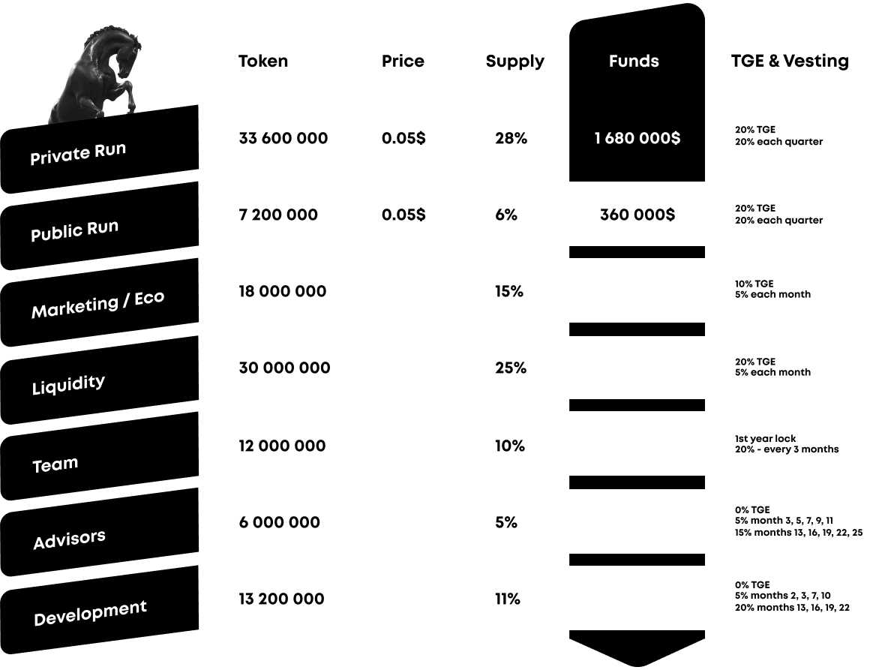
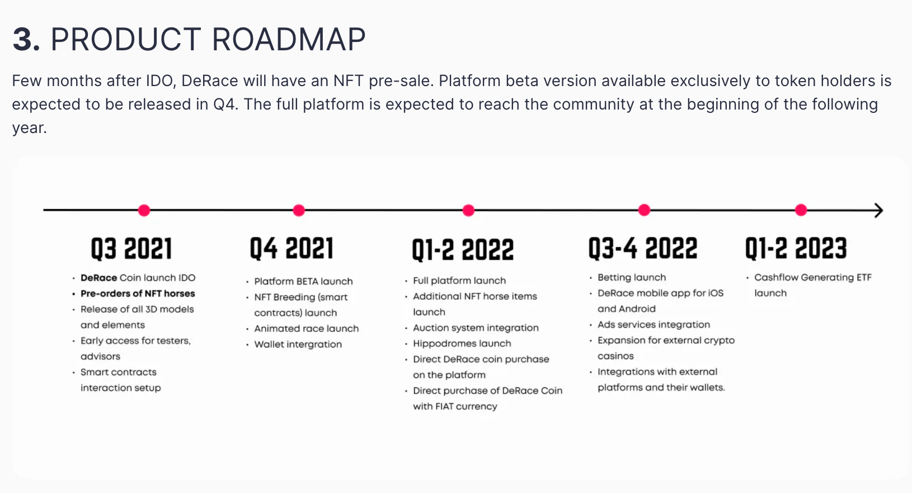
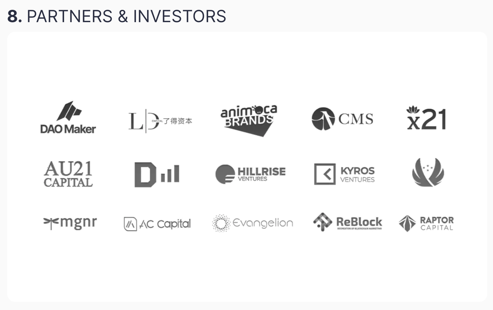

# Гайд по токеномике. Как оценивать, куда смотреть и как правильно её читать (на примере DeRace).
- [источник](https://t.me/idoresearch)
---

## Введение
[DeRace](https://daomaker.com/company/derace) представляет из себя NFT игру, ипподром на блокчейне, где вы можете покупать и улучшать вашу лошадь + участвовать на ней в скачках и получать за это деньги. Теперь разберем метрики. Поехали.

## Токеномика

1. Общий сбор ± 2 млн\$. Это очень адекватный сбор по рынку, все что ниже 2млн - всегда хорошо, все что выше 3.5-4 млн - либо жесткая переоценка, либо сильно амбициозный проект. Здесь мы видим золотую середину, в целом.

2. Общий саплай токенов - 120 млн. Цена паблика 0.05\$. При полной циркуляции токенов в рынке - Market Cap проекта будет всего 6млн\$. Это очень, очень мало для подобной истории. Здесь прям лайк. Всё что стоит ниже 10 млн при полной оценке - всегда достаточно перспективные проекты. Тем более, проект выходит на рассвете хайпа и внимания к NFT играм, поэтому в нашем случае это огромный плюс.

Разлоки. 
- команда: лок на 1 год, значит в ближайший год бесплатных токенов не будет. Да и сама команда заинтересована в том, чтобы сначала реализовать свои идеи и проект, а потом только с этого зарабатывать.
- адвайзеры: 0% на ТГЕ и затем первый разлок в 5% только через 3 месяца. Зачастую, адвайзеры не особо любят холдить токены проектов, хоть и распинаются в любви к нему на этапе подготовки к TGE. В нашем случае - эти советчики 3 месяца будут курить без токенов и будут вынуждены дальше помогать проекту развиваться. Плюс, это отсеивает псевдополезных адвайзеров, которым наплевать на проект, так как заработать с первого разлока у них не выйдет.
- маркетинг: 10% и затем по 5% в месяц выглядит суперсбалансированно. Маркетинг после TGE всегда требует больше внимания, так как надо дать рост токену, но ограничение в 10% дает вам понимание отсутствие большого количества токенов в рынке от инфлов, которые не умеют холдить и всегда льют.
- паблик и приват: ежеквартальный разлок. Вообще шикарно, это дает нам понять, что ближайшие 3 месяца проект не будет подвержен давлению новых токенов на стакан, поэтому ему можно спокойно заниматься разработкой и развитием, и не переживать что каждый месяц приват будет проливать их токен.
- заключение: супер живая и здоровая токеномика.

## Roadmap

До ближайшего разлока токенов они планируют реализовать предзаказы на NFT коней, релизнуть 3D модели, запустить Бета-платформу и скрещивание NFT + выкатить анимацию будущей гонки. Это дает нам понять, что если они выдержат сроки, и людям это понравится, то токен они будут покупать именно у нас, ведь новых токенов в рынке в эти 3 месяца не появится. Здесь всё нравится.

## Инвесторы проекта

Естественно, видим на бэках DAO, которые прекрасно понимают вектор развития индустрии и то, что сейчас вся ликвидность перетекает к геймифай в крипте. Но самый большой интерес здесь представляет Animoca Brands. Эти ребята с 2014 года занимаются тем, что разрабатывают и продвигают игры. И занимались они продвижением таких проектов, как CryptoKitties и Axie. Думаю, что эти имена говорят сами за себя. Плюс на поддержке ReBlock - который даст выход и охват азиатского рынка, а они очень хорошо с этим справляются.

## Резюме
Когда вы оцениваете токеномику, всегда обращайте внимание и на роадмап, и на стратегических партнеров. Набрать кучу бесполезных фондов - еще не значит, что эти фонды могут дать хоть какую-то пользу, кроме денег. А здесь мы видим синергию очень здоровой токеномики, ежеквартальных разлоков, маленького маркеткапа при полном разлоке и набора необходимых подобному проекту инвесторов. И именно такой порядок оценки проектов позволит вам находить для себя очень интересные кейсы для инвестиций. Всем отличного вечера.