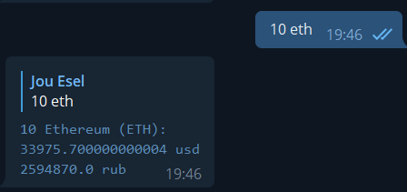

## notslava_bot
- [link](https://t.me/anything_notslava_bot)

Телеграм бот, с помощью которого легко можно узнать стоимость определенного количества тех или иных монет.

## baoeuckqo_bot, binanceNftStats_bot
- [1](https://t.me/baoeuckqo_bot), [2](https://t.me/binanceNftStats_bot)

Телеграм боты, следящие за ценами NFT маркетплейса Binance.

## listingsinfo
- [link](https://t.me/listingsinfo)

Оповещает о листинге на ту или иную биржу.

## EtherDROPS_bot
- [link](https://t.me/EtherDROPS1_bot)

Notification bot for ALL coins and DeFi projects. Receive notifications of price movements and liquidity pool change

## Crypton_research
- [link](https://t.me/crypton_research_bot)

Новостной бот от криптон академии.

## OTCGod_bot
- [link](https://t.me/FloorPriceRobot)

Поиск сразу по нескольким OTC площадкам! Помогает быстро узнать среднюю стоимость покупки/продажи чего-либо

## @FloorPriceRobot
это еще один удобный инструмент из нашего арсенала. Он решает очень простую, но времязатратную функцию, а именно отлеживание FloorPrice коллекциий на OpenSea. 

В самом маркетплейсе есть функция Watchlist (https://opensea.io/my-watchlist), но как нам кажется, удобнее отслеживать через телеграм бота. В него можно добавить до 50 коллекций и нажатием одной кнопки получать актуальную стоимость самой дешевой NFT из коллекции в ETH и USDT.