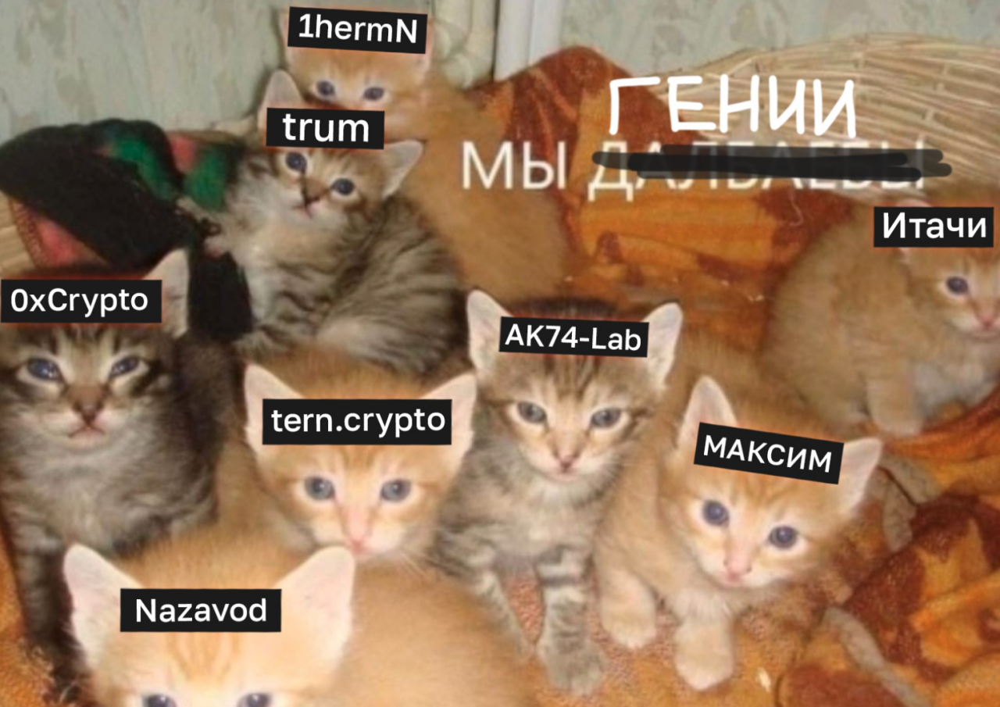

# Список Telegram-каналов
Стоит подписаться вообще на все каналы и начать читать все под ряд, ведь только вы знаете, какой контент вам нужен.

## Прога

- https://t.me/zx_crypto
- https://t.me/ak74lab
- https://t.me/n4z4v0d
- https://t.me/devsofcrypto
- https://t.me/terncrypto
- https://t.me/cyberacademy
- https://twitter.com/eslampy
- https://t.me/nifoleko_mclaren
- https://t.me/cryptoitachik

## Крипта

- [TradeParty](https://t.me/tradeparty1337)
- [Nifoleko](https://t.me/nifoleko_mclaren)
- [ТВС](https://t.me/tvsteeam)
- [9RS](https://t.me/young_rich_nosmart)
- [nazavod](https://t.me/n4z4v0d)
- [serp1337](https://t.me/serp1337pub)
- [Ректовальщик](https://t.me/rektovalshik)
- [A&K](https://t.me/alekkry)
- [Seva торгует](https://t.me/sevaexp)
- [Early Berkut](https://t.me/earlyberkut)
- [Максим пробует крипту](https://t.me/maxycrypto)
- [tern.crypto](https://t.me/terncrypto)
- [EvilMeett Smart Moves](https://t.me/evilmeett)
- [HinkoK](https://t.me/HinkoK)
- [how_to_node](https://t.me/how_to_node)
- [Defiscamcheck](https://t.me/Defiscamcheck)
- [devsofcrypto](https://t.me/devsofcrypto)
- [idoresearch](http://t.me/idoresearch)
- [territoria_elfov](https://t.me/territoria_elfov)
- [moni_talks_ru](https://t.me/moni_talks_ru)
- [ghost_in_the_block](https://t.me/JUST_SOME_TEMP)
- [zx_crypto](https://t.me/zx_crypto)
- [cryptoholy](https://t.me/cryptocholy)
- [rickler_cash](http://t.me/rickler_cash)
- [Crypto farm](https://t.me/farmcryptovprofit)
- [secret_invest](https://t.me/secret_invest)
- [CryptoLamer](https://t.me/CryptoLamer)
- [icodrops_sergey](https://t.me/icodrops_sergey)
- [Крипто Кэшимир](https://t.me/CryptoCashiMir)
- [lobsters_chat](https://t.me/lobsters_chat)
- [BLACK TARAXACUM](https://t.me/blacktaraxacum)
- [Misko4b Party](https://t.me/Misko4bParty)
- [HinkoK](https://t.me/HinkoK)
- [Main [RU]](https://t.me/toyzlemain)
- [Криптохомо](https://t.me/ckryptohomo)
- [Lagerty](https://t.me/lagertycrypto)
- [Путь к миллиону[chopp1x]](https://t.me/chopp1x_to_million)
- [k3rol](https://t.me/k3ro1)
- [игорь изучает крипту](https://t.me/igorizychaetcrypty)
- [Поток](https://t.me/potokcrypto)
- [crypto_sheesh](https://t.me/crypto_sheesh)
- [BanklessRU](https://t.me/BanklessRU)
- [cryptol00t](https://t.me/cryptol00t)
- [nft_cult](https://t.me/nft_cult)
- [scumtester](https://t.me/scumtester)
- [notothemoon](https://t.me/notothemoon)
- [dropsearnimp](https://t.me/dropsearnimp)
- [profitik](https://t.me/profitik)
- [ownlunapark](https://t.me/ownlunapark)
- [t.me/greezblog](https://t.me/greezblog)
- [fackblock](https://t.me/fackblock)
- [CryptoHan](https://t.me/cryptohan22)
- [colnft](https://t.me/colnft)
- [VeVe Russian Community](https://t.me/VeveRussianCommunity)
- [massterskaya159](https://t.me/massterskaya159)
- [Degen_Hustle](https://t.me/Degen_Hustle)
- [from_alexdevps](https://t.me/from_alexdevps)
- [crypto_linker](https://t.me/crypto_linker)
- [swoptoky](https://t.me/swoptoky)
- [stzoff](https://t.me/stzoff)
- [cryptoprib](https://t.me/cryptoprib)
- [cryptotatars](https://t.me/cryptotatars)
- [hobotilnya](http://t.me/hobotilnya)
- [swiper_money](http://t.me/swiper_money)
- [mudrevskiy_corporation](http://t.me/mudrevskiy_corporation)
- [Фармер](https://t.me/allfarm)
- [logovoborovovAvyzerov](https://t.me/logovoborovovAvyzerov)
- [cryptonotions](https://t.me/cryptonotions)
- [tokensale_hunters](http://t.me/tokensale_hunters)
- [mnstmoney](https://t.me/mnstmoney)
- [edwardmorra_ru](https://t.me/edwardmorra_ru)
- [doubletop](https://t.me/doubletop) + [статья](https://link.medium.com/eGPx0ZySngb)
- [slavik_investor](https://t.me/slavik_investor)
- [cryptogamers2](https://t.me/cryptogamers2) + [YouTube](https://www.youtube.com/c/CryptoGamers2)
- [procryptopro](https://t.me/procryptopro)
- [NFTGuide](https://t.me/NFTGuide)
- [d1msoluno](https://t.me/d1msoluno)
- [cloudgeo1](https://t.me/cloudgeo1)
- [Vrag_Nebes](https://t.me/Vrag_Nebes)
- [soulmatescrypto](https://t.me/soulmatescrypto)
- [NodesGuruNews](https://t.me/NodesGuruNews)
- [letskynode](https://t.me/letskynode)
- [jarvis_labs](https://t.me/jarvis_labs) (ENG)
- [defiyield_app](https://t.me/defiyield_app) (ENG)
- [thedailyape](https://t.me/thedailyape) (ENG)
- [defiprime](https://t.me/defiprime) (ENG)
- [unfolded](https://t.me/unfolded) (ENG)
- [glassnode](https://t.me/glassnode) (ENG)

# Closed chats
- [Crypton Academy](../Инструменты/Приватные%20каналы/Crypton%20Academy.md)
- [Crypto Taverna](https://t.me/crypto_taverna). Как и криптон академия, является чем-то приватным за маленькую стоимость, но отличие от академии в том, что таверна = флиперское сообщество, а академия = фундаментальное. [Таблица с актуальными темами](https://clck.ru/XT6nyэ)

- [AVG](../Инструменты/Приватные%20каналы/AVG.md)

---
• [t.me/IKSYcapital](https://t.me/IKSYcapital) - концентрация людей, которые инвестируют в кл и в другие смарт-идеи, инвестируют в очень и очень больших масштабах, рекомендую

• [t.me/drops_daily](https://t.me/drops_daily) - канал от ру крутого крипточувачка, но постинг происходит не в режиме лайв-контента, а в виде новостей от различных проектов.

[t.me/moni_talks_ru](https://t.me/moni_talks_ru) - это отдельная тема для разговора, это не просто канал, а целая экосистема, над которой трудится команда опытных криптанов. Своя почтовая рассылка, в которой они каждый день делают выжимку из 1000 источников, пытаются найти гемы и поделиться ими с вами (ЭТО ОЧЕНЬ И ОЧЕНЬ КЛАССНО), есть свой ютуб канал, где постоянно проводят гемовые стримы (это тоже классно, участники стримов передают бесценный опыт в мире крипты), и самое главное - у них есть свой приложение для анализа своих бск денег (в будущем будет и эфир и вообще всё-всё-всё)

[t.me/thevse](https://t.me/thevse) - канал опытного чела (рили опытного, ему уже за 30), обычно постит уже знакомые нам темы - сейлы, аирдропы и т.д., но всё же сделано все это очень лаконично и структурировано, и все это приправлено наличием обилия потенциальных гемов

[t.me/notothemoon](https://t.me/notothemoon) - чувачок, который меня неплохо так зашиллил пару недель назад, за что я ему очень и очень благодарен, спасибо! Так вот, теперь моя очередь. Основа контента - гемные подборки чего-либо и постинг всяко-разного. Честно, иногда мне сложно читать подобные каналы, так как нет прямого призыва к действию и примера профитов, но ведь это не спроста = деньги любят тишину, а в подобных темках их очень много.

## `**Маленькие (именно для лоубанков)**`

[t.me/Evilmeett](https://t.me/Evilmeett) - ламповый канал с небольшой аудиторией, основа контента, как указал автор - крипто-мир, схемы, абузы, но сейчас выходит больше постов про NFT-сейлы, что логично сейчас (октябрь)

[t.me/bomzhuem](https://t.me/bomzhuem) - тоже новый канал, заметил недавно, постит обычно тоже про все, что есть сейчас на хайпе.

[t.me/luzhazhabi](https://t.me/luzhazhabi) - жабка :) мне человек, который ведёт этот канал, сразу приглянулся, очень ламповый чел. Вся актуальщина на данный момент, но есть фишечка...

[t.me/crypt0jones](https://t.me/crypt0jones) - канал моего друга, который в одно и то же время и новичок, и уже опытный в некоторых сферах. Можете подписаться и поддержать его за...

[t.me/fil1pon](https://t.me/fil1pon) - эмосэдбой, мой брат филипон, тут больше блог о рил лайф, но крипта тоже есть, вам определенно понравится этот канал (ну или не понравится)

[t.me/NFTSALEINFO](https://t.me/NFTSALEINFO) - канал Малышки из Дубая, который пытается с крипты заработать на третий мерс, а именно в Дубае, начинал путь с дворпца, теперь живёт в однушке

[t.me/crypto_studentt](https://t.me/crypto_studentt) - бложик одного школьника, которому 14 лет (по крайней, мере было 3 апреля), на удивление, очень дивный юный ум и несмотря на возраст залетает в далеко не детские темки. На данный момент, как и все темщики залетает в НФТ, кл и т.д.

[t.me/CryptoEazer](http://t.me/CryptoEazer) - канал чувачка, который пытается с крипты заработать на жизнь в ОАЭ, а именно в Дубае, начинал путь с общаги, теперь снимает хату, короче, нужен лайв-контент? - залетайте

[t.me/sxemi_birba](https://t.me/sxemi_birba) - пуська, Публикация схем, аирдропов, NFT сейлов и т.д

[t.me/cryptomoney2genius](https://t.me/cryptomoney2genius) - 2 чувака ведут канал для лоубанков

[t.me/cryptxyrma](https://t.me/cryptxyrma) - новенький канал, который хочет развиваться и дать возможность развиваться другим, буду старается постить новости в живом ключе и отвечать на все вопросы