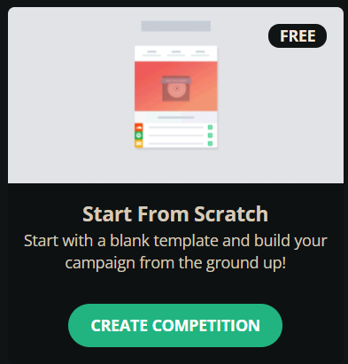
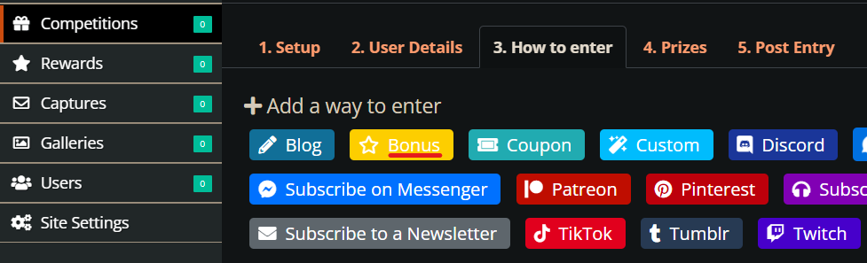
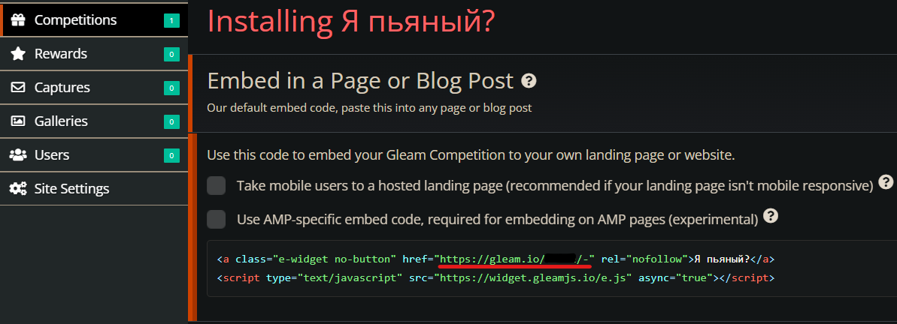
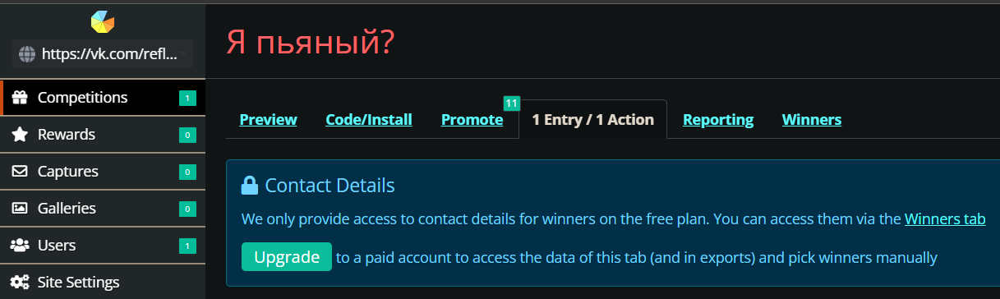
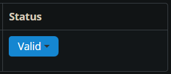

# Абуз Gleam-форм
- [Оригинальная статья](https://teletype.in/@dim1562/abusgleam.io).
- [Оригинальная статья @rektovalshik](https://telegra.ph/Metodichka-po-multiakkingu-11-12).
- [Youtube видео](https://youtu.be/tTcqsLUz7JM).
---

## Введение
Сейчас очень много проектов используют сервис gleam.io для того, чтобы проводить различные розыгрыши. Большинство правил из [статьи по базовым принципам абуза и мультиакинга](Абузы%20и%20мультиакинг.md) будут применимы и к абузу Gleam-форм. В этой же статье будет разобраны некоторые особенности абуза этих конкурсов.

Я бы отнёс данный вид форм к Hard уровню, потому что для них, во-первых, требуются дорогостоящие прокси _(они не пропускают дешёвые прокси с сайта_ [_Proxy House_](https://www.proxy.house/)_, поэтому приходится покупать их на_ [_Proxyline_](https://proxyline.net/)_)_ и, во-вторых, данная форма обязательно требует привязку социальных сетей для проверки выполнения заданий.

## Подготовка и абуз
В абузе Gleam-форм самое главное - тщательная подготовка аккаунтов.
[Подготавливаем все необходимое](Абузы%20и%20мультиакинг.md): аккаунты Дискорд, Твиттер, Телеграм, почта Rambler или другая почта, Прокси и [антидетект браузер](../Списки/Список%20Антидетект-Браузеров.md). 

Сам абуз не представляет из себя что-то сложное: просто проходим задания из формы на каждом аккаунте и ждем результатов. Но новички часто могут наступать на грабли, которые больно бьют по мотивации. Попробуем на наступить на эти грабли.

## Твиттер
- Есть внутренняя проверка твиттера и, например, сегодняшние новореги он будет считать ботами.

- Не забудьте поставить аватарку на свой Twitter аккаунт, иначе вам может выдавать ошибку при заполнении формы:

## Повторное использование аккаунтов
С привязкой социальных сетей (Twitter, Discord) есть небольшая хитрость: после успешного выполнения всех заданий можно отвязывать их от аккаунта.

Делается это следующим образом:
1. Выполняем все задания, например, связанные с Twitter.
2. Нажимаем на кнопку "Edit", находящуюся рядом с "Logout":

3. Нажимаем на крестик и "Save":

4. Теперь можно выходить с аккаунта и привязывать Twitter к следующему аккаунту.

## Использование антидетект браузера
В целом, на каждом профиле антидетект браузера можно заполнить около 15-20 Gleam, после чего часто возникает ошибка "too many entries" из-за большого количества заполненных форм с одного айпи. Решается она сама по себе через несколько дней, поэтому при появлении такой ошибки нужно будет просто перейти на другой профиль антидетект браузера.

## Прокси
Чаще всего для вайтлистов подходят ipv4 shared прокси. Дешёвые ipv4 shared прокси, к сожалению, не подойдут для работы с формами Gleam. Поэтому для таких форм понадобится брать более дорогие прокси, например, на [Proxy6](https://proxy6.net/en/) или [Proxyline](https://proxyline.net/).

Следующие проблемы решаются сменой прокси:
- При входе в глим выбивание капчи "One more step Please complete the security check to access gleam.io" может быть связано только с IP, никак не с отпечатком. При создании глима можно настроить заполнение капчи и сделать ее обязательным, но это будет либо в окне глима перед входом, либо при совершении первого действия.

- Если вас банят до авторизации или соглашением с правилами, то это дело только в IP, так как они пишут в соглашении, что они собирают данные по отпечатку только после авторизации, либо соглашения с правилами.

- Ошибка #1020.

## Теневой бан
Люди создают сотни аккаунтов, но никак не могут выиграть даже в не очень известном конкурсе. Вероятно, некоторые из аккаунтов попали в теневой бан  — ограничение, накладываемое сервисом на аккаунт без предупреждения и информирования.

> У них есть теневой бан, когда аккаунт помечается как "invalide". Условия не разглашаются. Но как минимум есть валидатор почты, который проверяет почту на существование и ряд других функций, можно попробовать посмотреть [здесь](https://verifalia.com/validate-email), - @th0masi

Узнать, есть ли на аккаунтах ограничения, не сложно.
Делается это следующим образом:
1. Регистрируемся на сайте [gleam.io](https://gleam.io/).

2. В форме регистрации просят указать сайт: можно указать аккаунт в соцсетях.

3. В разделе Competitions выбираем бесплатную форму *Start From Scratch*:

4. Заполняем обязательные поля формы и добавляем простйшее (*Bonus*) задание:

5. Копируем ссылку на прохождение формы, сохраняем ее и проходим глим с аккаунтов, требующих проверку на теневой бан:

6. Заходим во вкладку Entry/Action:

7. Смотрим статус аккаунтов. Статус "Invalide" -> аккаунт в бане!

## Другое
- Выбор победителя именно через глим никак не зависит от количества очков. Списку пользователям присваиваются значения от 1 до х и дальше рандомно выбираются выигрывшие пользователи _(так работает через глим, но никто не отменяет выгрузку в таблицу и далее уже они там как хотят)_. Опять же, недействительные не учавствуют ни в выгрузке, ни при выборе победителя. 

- Выбор победителей может быть в диапазоне по дате, поэтому рекомендуется заполнять в разные дни.

- "Sorry, you're creating too many entries; try again later":
Решение: ждем пару часов - эта надпись должна пропасть.

- Через сам глим невозможно настроить экспорт по стране IP. Условно это можно сделать в настройках, но выгрузить, к примеру, "всех, кроме СНГ" будет невозможно. Опять же, исключение - если они через таблицы сами не вырезают эти строки.

После выгрузки данных из тестовой формы узнаем следующее:
- Для начала экспорт данных выглядит вот так:

 Она не экспортирует число участников, а просто все действия, причём если 2 раза щелкнуть, то можно отсортировать по количеству очков. Убрать страну полностью - это реально сделать, если выбирать руками победителей.

- Всё-таки очки важны, а именно количество действий, потому что выбор победителей через глим записывает каждое действие отдельной строкой. Выбор победителя не человека как такого, а строки из действий, которое совершил данный человек. Соответственно, вывод: чем больше действий, тем больше записей о тебе в таблице и тем больше шанс выиграть.

- IP не выгружаются, поэтому условно никак нельзя проверить, делал ли ты задания с 20 акков с 1 айпи при выгрузке в таблицу, но есть возможность посмотреть все действия человека с определенного IP, где можно спалиться.

## Боты и софт
Боты для Gleam-форм, в основном, пишутся на [BAS](https://bablosoft.com/shop/BrowserAutomationStudio#download).