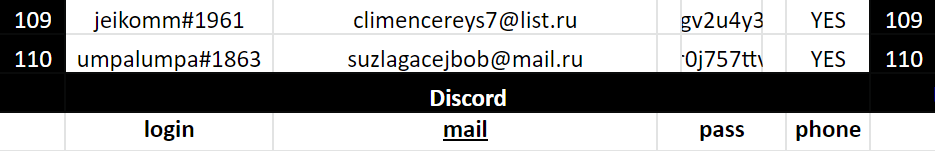

# Абузы и мультиакинг
- [Оригинальная статья @rektovalshik](https://telegra.ph/Metodichka-po-multiakkingu-11-12)
---

## Введение
В этой статье будут кратко изложена самая важная информация по мультиакингу и абузу, а также некоторые приемы, которые должен знать каждый.

Для чего нужен мультиаккинг? Я думаю, что вы заметили огромную проблему всех вайтлистов, где за подписку/лайк/ретвит могут дать аллокацию любому желающему, - большое количество участников. Часто бывает так, что на 300 аллокаций может претендовать более 100'000 человек, что, конечно, делает шанс выигрыша в вайтлисте ничтожным. Но есть выход - мультиаккинг. Математика очень проста: шанс на победу, если вы сделаете 100 аккаунтов, в 100 раз выше, чем если бы вы сделали всего 1 аккаунт.  

Многие думают, что мультиаккинг очень трудозатратен, на что я хочу вам сказать, что да, так и есть. С помощью него вы сможете выбивать много аллокаций на хорошие проекты, но в то же время вы потратите много сил и временных ресурсов на выполнение сотен заданий, заполнение сотен форм. Я считаю, что данный метод получения аллокаций подойдёт для тех, у кого пока совсем скромный капитал _(до $100'000)_, так как он не требует крупных денежных затрат *(всего лишь $200-500 на различные аккаунты).*  

## Дискорд аккаунты
Я не сказал бы, что Discord аккаунты часто бывают нужны, так как их нужно обязательно использовать разве что в каких-то Gleam формах или для накрутки рефераллов в какой-то Discord сервер, но всё же стоит упомянуть про них.  

Их антимультиаккерская система работает слабенько _(на уровне Telegram)_, поэтому там можно смело заходить на много аккаунтов с одного устройства и не волноваться за баны _(по крайней мере, в последнее время я их не замечал)_.

- Чтобы сервер мог засчитать аккаунт в качестве реферала нужно, чтобы:
    1. аккаунт был зарегестрирован более 7-ми дней назад.
	2. аккаунт находился на любом сервере 3-7 дней.
	3. аккаунт имел подтвержденную почту (Всегда идет в комлекте с дискорд-аккаунтом).
- Меняем никнейм на человеский, ставим на аватарку анимешную девочку или обезьяну: так мы больше будем похожи на человека.
- Некоторые серверы требуют подтвержденный номера телефона для начала общения и чтобы реферала можно было засчитать. Добавляем номер через [sms-activate](https://sms-activate.org/ru/getNumber) или [5sim](https://5sim.net/), чтобы это не застало в расплох в самый ответственный момент.

-> [Список магазинов Discord аккаунтов](../Списки/Список%20Магазинов%20Дискорд-Аккаунтов.md).

## Twitter аккаунты
Twitter - это самая непонятная в плане защиты от мультиаккаунтов социальная сеть. Вы спросите "а почему?", на что я вам отвечу, что данная платформа может банить ваши аккаунты просто так. Да, вы не ослышались, "просто так" является частой причиной блокировки аккаунтов. То есть вы можете впервые зайти на аккаунт, попробовать выполнить какое-либо действие и обнаружите, что ваш аккаунт в перманентом или временном бане.

Я могу вам точно сказать, что в конце концов любые Twitter аккаунты, которые вы купите для вайтлистов, забанят, но, конечно, можно увеличить срок жизни аккаунтов, используя прокси с антидетект браузером при запуске аккаунтов.

- При покупке, твиттер аккаунт лучше брать с отлежкой от 6-ти месяцев.
- Часто аккаунты не засчитываются в качестве рефералов из-за отсутсвия аватарки профиля: обязательно ставим аватарку (желательно, связанную с криптой)
- Новые аккаунты банятся в течении недели из-за того, что не были накручены первые 10-20 подписиков.

-> [Список магазинов Twitter аккаунтов](../Списки/Список%20Магазинов%20Твиттер-Аккаунтов.md)

## Создание кошельков
В 99% вайтлистов при регистрации требуют указать ваш кошелёк. Конечно же, можно создавать сотни кошельков вручную в том же Metamask, но вы затратите на это слишком много времени., поэтому я советую использовать [Cointool](https://cointool.app/dashboard):

-> [Работа с CoinTool](../Инструменты/Сервис%20CoinTool.md)

## Почты
Для регистрации аккаунтов на большинстве сайтов требуют почту, к которой нам нужен доступ _(не получится просто написать какую-нибудь рандомную)_, так как она нам может понадобится для получения писем с различными кодами подтверждений или для проверки результатов вайтлиста.

Используем [Rambler](https://www.rambler.ru/) из-за лояльности к пользователям (почты не банят), низкой цены и, конечно же, привлекательного дизайна.

Покупаем почты по 0,12 руб в магазине [install-shop](https://install-shop.com/?cat_id=327)  

К сожалению, не во всех формах принимают почты с доменом mail.ru, поэтому, например, для [Sweepwidget](Абуз%20Sweepwidget.md) форм нужно покупать почты с другими доменами. Для них можно использовать gmail.com (не советую, так как они слишком дорогие), [hotmail.com](https://outlook.live.com/owa/), [outlook.com](https://outlook.live.com/owa/), [yahoo.com](https://www.yahoo.com/).

## Telegram Аккаунты
Телеграм-аккаунты, хоть и не часто, но используются в абузе различных вещей и мы не можем игнорировать очердную схему с использованием Телеграм-аккаунтов лишь потому, что наша ферма похожа на горшок с луком на подоконнике.

-> [Ферма Telegam-аккаунтов](Ферма%20Telegam-аккаунтов.md) 

## Антидетект браузеры
Некоторые сервисы серьезно борятся с мультиакерами, которые, в свою очередь, ведут борьбу с их анти-фрод системами. Использование антидетект-браузеров дает значительное преимущество в этой войне, на какой ценой?

Это программы, которые подменяют отпечатки браузера, уникализируют работу в интернете и позволяют работать одновременно с множеством аккаунтов на различных сайтах. В нынешнее время на рынке существует достаточно много различных антидетектов, поэтому ниже я приведу их список, из которого вы сможете выбрать подходящий вам браузер.

-> [Работа с антидетект-браузерами](Работа%20с%20антидетект-браузерами.md)

## Прокси
Прокси-сервер – это удаленный компьютер, который выступает посредником между пользователями и интернет-ресурсами. Его задача состоит в том, чтобы все запросы от пользователя передавать в сеть интернет, а полученные ответы транслировать обратно.  

То есть вы, например, можете находиться в России, но, работая через прокси с каким-либо сайтом, он может считать, что вы из Англии. Прокси используют для того, чтобы различные сайты не смогли определить с помощью своей антифрод системы, что вы уже зарегистрировали там сотни аккаунтов, вместо одного дозволенного.

Прокси играют важную роль в мультиаккинге, так как часто без них ваши Twitter аккаунты могут банить, а также такие платформы для проведения вайтлистов, как Gleam и Sweepwidget, запретят вам участвовать в вайтлистах на них.  

-> [Список некоторых магазинов, где можно купить прокси](../Списки/Список%20Магазинов%20Прокси.md).

## В каком формате хранить данные?
Очевидно, что не стоит хранить данные в обычном текстовом файле.
Данные для входа в мультиаккаунты не являются сильно-важной информацией, поэтому мы можем позволить себе хранить их в обычной Google-таблице в нашем рабочем аккаунте, на защищая ее крипто-контейнером и не засовывая ее в запароленный архив.

В таблице должна храниться как минимум следующая информация:
- Адрес и мнемоническая фраза основного кошелька (Metamask).
- Адрес и мнемоническая фраза Solana кошелька (Phantom).
- Дискорд аккаунт: никнейм, почта, пароль, привязка телефона (Да/Нет).
- Твиттер аккаунт: никнейм, почта, пароль.

Оформлять можно следующим способом:

