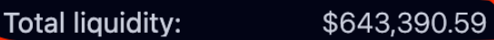
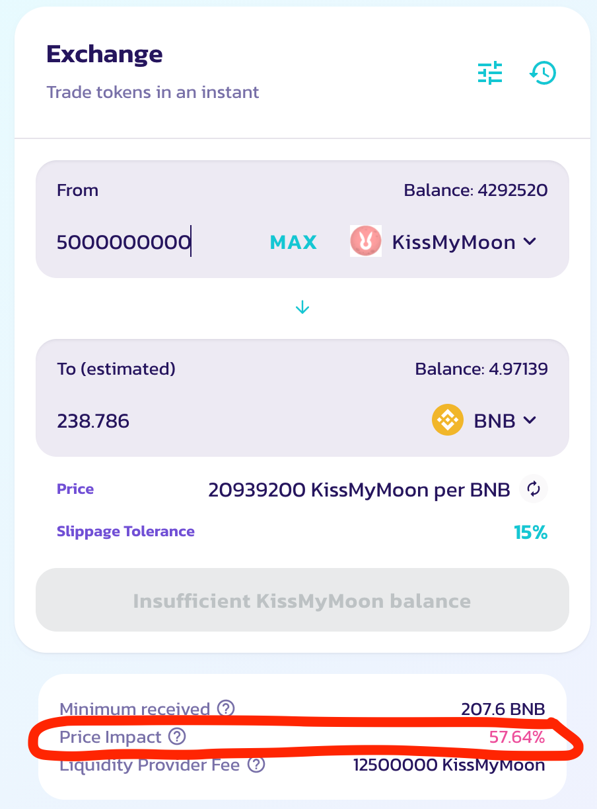

# Как подобрать проскальзывание и газ во время слива токенов на Pancake/Uniswap/QuickSwap ..?
- [Оригинальный пост](https://t.me/idoresearch/282)
---

Рассмотрим вопрос того, как правильно подобрать проскальзывание (slippage) и газ (gas) во время слива токенов, чтобы уменьшить шанс фейла транзакции.

Итак, когда мы торгуем на DEX’е - мы покупаем и продаем не у других участников, а у пула, в котором лежит ликвидность (токены и их пара). Соответственно, при сливе в этот пул токенов - наша задачать сделать это быстрее всех. И даже если кто-то сделал это быстрее, то проскальзывание должно позволить слить сразу же после этих ребят. Проскальзывание - это как раз и есть допустимое расхождение цены, на которое мы согласны при свапе, пока транзакция обрабатывается. 

## Как устроена механика свапа в DEX обменниках
Для того, чтобы обработать транзакцию, мы должны выставить газ. Это плата за обработку транзакции майнерам. Но здесь работает правило, что, кто больше платит, того и быстрее обслуживают. Соответственно, если у нас будет стоять 50 газа, а у другого человека 100, то его транзакция обработается быстрее. Следовательно, после того, как его транзакция обработается, соотношение в пуле поменяется и цена изменится. И, когда дело дойдет до обработки нашей транзакции, цена покупки/продажи, на которую мы соглашались при нажатии кнопки *SWAP*, может быть уже не актуальна и транза сфелится.

И именно для этого мы и проставляем проскальзывание, которое позволяет выставить то самое расхождение, на которое мы согласны, если перед вами влетят с большим газом в блок с транзакциями. 

Например:
Влетает несколько человек перед нами с большим газом. Продают пулу токены и цена меняется на 10%. Но если нашe проскальзывание больше 10%, то наша транзакция пройдет, так как мы изначально были готовы на такой сценарий. А если ваш проскальзыване будет меньше 10%, то транзакция сфейлится.

## Как подобрать количество газа
Количество газа нужно ставить в несколько раз больше нынешнего средного газа сети. В три раза больше для сети ERC-20 и в 50 раз больше для сети BSC.

## Как подобрать допустимое проскальзывание
Зачастую, после того, как токен залистится, токены с IDO/presale всегда раздают с задержкой в 15-30 мин. И как раз за это время мы можем оценить ликвидность и валатильность цены. Для этого нам всего надо посчитать количество токенов на руках на момент TGE. Это называется Initial supply. Зачастую все проекты пишут это количество в токеномике/группах. И вот, когда ликвидность залили, заходим на график монеты через [Poocoin](https://poocoin.app/) или [Dextools](https://www.dextools.io/app/) и смотрим, сколько ликвидности сейчас в пуле:

Соизмеряем количество токенов, которые вот-вот выльются на рынок и количество ликвидности. Если количества токенов по текущей цене в разы больше, чем ликвидности, то стакан сожрут за секунды. Поэтому тут только с большим слипом в 10+%.

...

Обычно 25-30% от initial supply летит в стакан в первых блоках, как только открывается клейм. И если, допустим, Initial supply 5 млн токенов, то следует ожидать порядка 1.25-1.5 миллиона токенов летящих в пул в первые секунды после открытия клейма. И за 1-2 минуты перед клеймом можно проставить это количество токенов на панкейке, даже если у нас их нет, и панкейк посчитает нам Price Impact: это и будет примерное изменение цены, если все эти токены сразу залетят в пул без откупа. 
Но откуп есть всегда, плюс они все равно будут залетать размазанно в течение 3-10 минут, поэтому проставляем в графе токенов примерно 25% от Initial supply, получаем предварительный Price Impact, режем его в 2.5-3 раза и получаем проскальзывание, с которым, скорее всего, транза пройдет с высоким газом:
