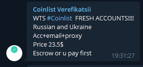

# Как провести идеальную сделку на OTC маркете? 
- Ссылка на оригинальную статью отсутствует.
---

## Введение
В эпоху хайпа NFT вайтлистов и Coinlist мультиаккинга всё больше и больше развиваются OTC сообщества. И, конечно, там, где есть деньги, есть и те, кто хочет у нас их забрать нечестным путём, поэтому стоит соблюдать определённые меры предосторожности при заключении сделок.

Для начала выясним, что же такое OTC. OTC расшифровывается как Over-the-Counter, в дословном переводе — минуя прилавок. Этим термином обозначается внебиржевая торговля. В криптовалюте такой вид торговли приобрёл популярность всего несколько лет назад, когда у многих криптанов появилась нужда продавать свои аллокации различных токенсейлов до выхода токенов на биржу.

На OTC площадках часто используют следующие обозначения:
- WTB — want to buy, хотят что-то купить.
- WTS — want to sell, хотят что-то продать.
- WTS kyc service — значит чувак продает верифы на разных площадках (соответственно, WTB хочет купить верифы на этих площадках).
- Escrow — гарант (человек через которого проводят сделки).
- Bulk — чего-то нужно много (или имеется много.



## Работаем через проверенных гарантов
Если нам предлагают человека, с которым мы еще не работали, то сразу нажно узнать, от лица какого OTC он работает. Далее сверяем его ник с ником из списка гарантов этого OTC. Не лишним будем удостоверится в подлиности гаранта, спросив про него у других пользователей: достаточно написать в любой чат по крипте.

## Проверяем OTC
Зачастую скамеры предлагают выбрать гаранта из какого-то рандомного OTC, где 10к+ подписчиков. Если мы не знаем, что это за OTC, то скипаем сделку, либо просим отзыв в знакомых крипто-чатах: вдруг кто-то уже работал через него. 
Если в маркет есть сомнения, то предлагаем свой либо отказываемся от сделки.

-> [Список актуальнах OTC маркетов](../Списки/Список%20OTC.md)

## Проводим сделку
Обговариваем детали сделки заранее и учитываем все детали. Этим должны заниматься гаранты, но даже у тех же 2TOP условия очень кривые, поэтому ниже я представлю свою версию “Договора”.

```
Предмет сделки: (название проекта)

Участники сделки: (ник гаранта + ники участников)

Стоимость сделки: x$ + y$ комиссия с покупателя / продавца / пополам
```

Порядок проведения сделки:
  1. Обговаривается порядок оплаты (после получения данных от аккаунта с WL, после минта, частичная оплата после получения данных от аккаунта с WL, остальное после минта).
  2. Обговаривается вопрос оплаты комиссии, в случае расторжения сделки. 
  3. Покупатель переводит сумму гаранту.
  4. Гарант подтверждает поступление денег.
  5. Продавец отправляет данные от аккаунта в ЛС покупателю.
  6. Покупатель проверяет наличие WL.
  7. После подтверждает, либо опровергает факт наличия WL.
  8. В случае отсутствия, сделка расторгается (вопрос с комиссией решен раньше).
  9. В случае наличия, покупатель меняет все данные от аккаунта, включая данные от почты.
  10. Покупатель подтверждает смену данных и дает согласие на перевод средств продавцу.
  11. Гарант переводит средства продавцу.
  12. Продавец подтверждает получение средств.
  13. Сделка завершается.

Особые обстоятельства:
1. Сделка будет состоявшейся, только после фактического минта NFT (в случае оплаты после минта).
2. Если продавец вписал кошелек, но по какой-то не связанной с покупателем причине, минт не состоялся, то средства возвращаются покупателю. Пример: админы проекта не вписали кошелек, с аккаунта сняли WL в последний момент, на админов упал камень и минт отменили или другое.
3. Если продавец вписал кошелек, но сделал это неверно (добавил лишнюю цифру, пробел поставил и т.д), то средства возвращаются к покупателю.
4. Если покупатель не заминтил NFT по своей вине: не захотел, не было денег, передумал минтить, то, в случае с оплатой после минта, деньги отправляются продавцу.
5. В случае длительной задержки минта для WL, покупатель может потребовать расторгнуть сделку в одностороннем порядке, предварительно уведомив продавца и передав ему данные от аккаунта (в случае с оплатой после минта).
6. В случае совершения ошибки при переводе денежных средств, гарант несет материальную ответственность.

После прочтения договора обе стороны должны согласиться с условиями!

# Виды скама на OTC площадках
## Схожие данные
- Нам могут предложить подставного гаранта, который будет иметь идентичный никнейм с настоящим гарантом, ведь некоторые буквы действительно сильно похожи (L и I, О и 0, 1 и I и l, q и p, Q и O). Также можно не заметить разницы в количестве нижних подчеркиваний (malsr000\_\_\_\_m и malstrооо\_\_\_\_\_m).

> Выбирая никнеймы для соцсетей, я специально забил схожие ники для того, чтобы не писать потом: "ой, ребята, появились скамеры, пишут от моего лица... Разница в никах нулевая, так что аккуратнее аоаоао!"

- Создать кошелёк, отличающийся парой символов, также не является проблемой. Сверяем кошелёк с адресами кошельков гарантов из закреплённого поста.

## Умышленный возврат аккаунта продавцом после совершения сделки
Даже если мы поменяем пароль и поставим мобильный аутентификатор, мы не сможем поменять изначальную почту, например, хуоби аккаунта, ведь для смены почты требуются паспортные данные, которые у нас отсутсвуют. А знаете что может сделать предприимчивый индус, который продал нам аккаунты зарегистрированные на документы цыганки и ее трёх сотен детей? Да! ВЕРНУТЬ СЕБЕ АККАУНТЫ ПО ДОКУМЕНТАМ!

Поэтому все KYC рекомендуется делать только через [KYC by link](KYC%20by%20link.md).