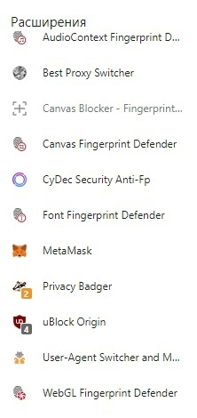
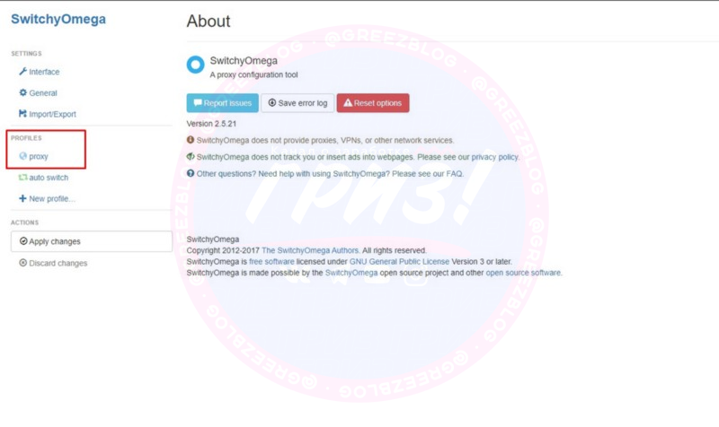

# Как мультиачить через профили Google Chrome?
- оригинальный пост отсутствует

Некоторые не готовы платить ежемесячно за использование антидетект браузера, а зря, окупается это дело с головой с первого же проекта.

Но решение вашей проблемы есть.  
Вы можете использовать обычный гугл хром, желательно установив подобные расширения:

Но как минимум должно быть расширение SwitchyOmega или любое другое для установки прокси, Canvas Fingerprint и User-Agent Switcher, или любые другие, чтобы менять отпечатки браузера.

## Как подключиться к прокси через обычный браузер
- [оригинальная статья](https://teletype.in/@greezblog/proksi_4.3)

Сначала скачиваем расширение SwitchyOmega из магазина Chrome — [ТЫК](https://chrome.google.com/webstore/detail/proxy-switchyomega/padekgcemlokbadohgkifijomclgjgif)

После установки переходим к настройке, выбираем прокси:

Далее вводим здесь адрес вашего прокси и его порт:

Потом нажимаете на замочек и вводите логин и пароль от прокси, который вам выдали в личном кабинете:

После того как все ввели не забываем сохранить изменения:

Далее не забываем включить сам прокси кликом по иконке расширения:

Все, прокси включен, можете пользоваться.

Если у вас есть антидетект браузер, то прокси там вводится сразу во время создания профиля, об этом мы поговорим позже.