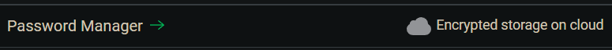
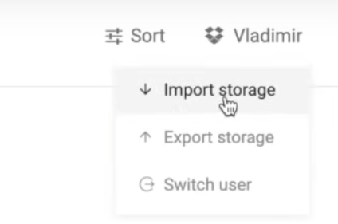
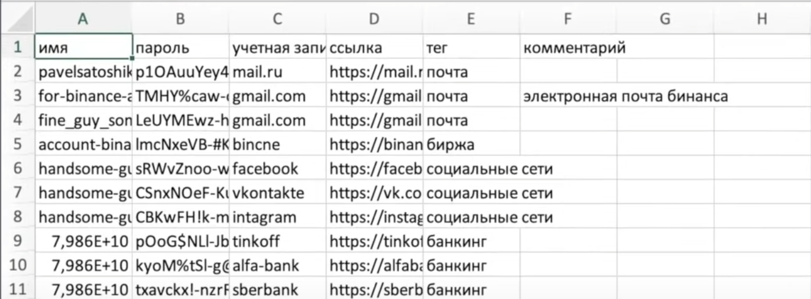

# Основы кибербезопасности и организация рабочего пространства
- [Оригинальная статья @maxycrypto](https://teletype.in/@maxycrypto/safe_in_crypto).
- [Оригинальная статья @hinkok](https://teletype.in/@hinkok/SafeInCrypto).
---

## Введение
У нас уже есть определённый банк, который мы конечно же не хотим отдавать хакерам. Для этого приходится всеми силами защать важные файлы с паролями и нюдсами для шантажа: мы храним всю важную информацию на защищенной паролем флешке в сейфе на чердаке, что, вообще-то, не является удобным. Но как тогда хранить данные так, чтобы это было и безопасно и удобно? Чтобы не приходилось каждый раз задрачивать флешку суванием в свой USB-порт? А главное - какие меры предосторожности стоит принять для защиты наших долларов и фотографий новорожденных котят?
  
## Составления сложных паролей
-> [Как правильно составлять пароли (Видео)](https://www.youtube.com/watch?v=17-tPwSvH6I)

Принципы, которые необходимо соблюдать:
1. Один аккаунт - один пароль.
2. Непредсказуемые пароли не менее 8 символов рядовых аккаунтов и не менее 20 для бирж и других важных аккаунтов.

## Хранение неважных данных
Мы стремимся как к удобвсту, так и к безопасности, но чем выше безопасность, тем меньше удобность пользовования этими данными.
Поэтому мы резделим данные на важныe, безопасностью коих мы не можем принебречь, и неважные, кража которых не грозит нам чем-то критичным.

Неважные данные и таблицы с паролями можно оставить в незашефрованном виде.
Таким образом, когда нужно будет посмотреть пароль от своей никому не нужной странички в соцсетях, мы не будем лезть на чердак, выскрывать сейф и вспоминать пароль от флешки, а просто посмотрим его в таблице или нам его напомнит расширение в браузере.

## Хранение важных данных в криптоконтейнере VeraCrypt
- [Как безопасно хранить пароли (видео)](https://www.youtube.com/watch?v=32--uZ-fjTk)

Мы не можем хранить важные данные на компьютере в незашифрованном виде или в зашифрованном архиве WinRar (архивы не предназначены для хранения важной информации и легко взламываются). Поэтому мы воспользуемся предназначенным для наших целей криптоконтейнером. Программ для создания криптоконтейнеров существует множество, но мы воспользуемся именно [VeraCrypt](https://www.veracrypt.fr/en/Downloads.html):

1. Скачиваем и устанавливаем [VeraCrypt](https://www.veracrypt.fr/en/Downloads.html)
2. Создаем новый конейтнер ([мануал](https://www.youtube.com/watch?v=MeT7ee0FJj8)) с действительно сложным паролем, который нам нужно запомнить или сохранить вне компьтера (на бумаге).
3. Копируем конейнер на флешки и прячем в надежные места - это будут наши аварийные резервные копии.
4. Можно загрузить контейнер в облако и работать через него: это более удобно, но мы также должны должны осознавать все риски (облако может стать недоступно по множеству причин (выход сервера из строя по причине природных катаклизмов, DDOS-атака, перегрев сервера и другие причины выхода оборудования из строя), аккаунт с доступом к облаку может быть взломан и особо предпреимчивый злоумышлинник может попытать взломать криптоконтейнер)

## Хранение важных паролей с использованием аппаратного кошелька Trezor
- [Работа с кошельком Trezor (видео)](https://youtu.be/3uIUDGdlgn8?t=385)

Действительно приятным способом хранения важных паролей является аппаратное решение [Trezor https://trezor.io/](https://trezor.io/). Trezor хранит пароли в облаке (GoogleDrive, DropBox), что удобно, но шифрует пароли так, что доступ к ним можно получить лишь имея на руках кошелек Trezor, привязаный к этому облаку.

1. Прежде всего, заказываем аппаратный кошелек Trezor на [официальном сайте](https://trezor.io/).
2. Переходим на [wallet.trezor.io](https://wallet.trezor.io/#/)
3. Устанавливаем микрокод (Обновляем прошивку кошелька), отсоединяем и подсоединяем устройство.
4. Создаем новый кошелек:
    - Сохраняем сид-фразу вне компьтера и делаем копии, чтобы ни в коем случае ее не потерять.
    - Здесь же можно установить пароль на кошелек (Блокировка по PIN).
5. Скачиваем расширение [Trezor Password Manager](https://chrome.google.com/webstore/detail/trezor-password-manager/imloifkgjagghnncjkhggdhalmcnfklk).
6. Открываем страницу расширения и логинемся в облако (GoogleDrive, DropBox).
7. Импортируем пароли (Правый верхний угол -> Import Storage):

Импортируем .csv таблицу следующего вида:

Теперь зайти в любую учетную запись можно будет только имея подключенный к компьютеру аппаратный кошелек.

## Деверсификация Email-почт
Рекомендуется использовать разные почты для повседнейвной жизни, бирж, социальных сетей и других видо сервисов, чтобы избежать путаницы в присылаемых письмах, не захламлять рабочие почты и смягчить последствия при взломе одной из почт.

На сайте [haveibeenpwned.com](https://haveibeenpwned.com/) можно узнать, была ли утечка той или иной почты.

> Также почта которую ты используешь для паролей нигде не должна палиться, называться твоим именем/ником и использоваться для общения с кем-то. Лично у меня сейчас одна публичная почта на которой нет вообще ничего важного, 5 почт для паролей и отдельная почта для крипты. Все они никак не связаны друг с другом и все они не содержат в названии моего имени/фамилии/никнейма.

##  Браузер и расширения
Рекомендуется использовать два профиля браузера: для работы и для повседневной жизни. В профиль браузера для работы воходим лишь в рабочие аккаунты и почту, а также установливаем только доверенные расширения во избежание взлома.

## Второй телефон
Обязательно заведите отдельный (невыносной) телефон, на котором будут стоять все  гугл-аунтификаторы. Просто представьте что будет, если вы сейчас потеряете свой основной смартфон? Эту ужасно...

## Второй компьютер
>Идеально было бы использовать один пк - только для крипты. Один - только для отдыха. Но не все могут себе это позволить. Поэтому перестаньте скачивать пиратский контент (я думаю игру в стиме за 2000 рублей вы уже можете себе позволить, да и карма будет лучше, поддержите разрабов, они старались). Фильмы/сериалы можете смотреть на сайтах, я смотрю на хдрезке, вообще кайф, почти всё есть на оригинале + с адблоком нет рекламы. Если же используете какой-то очень дорогостоящий софт, по-типу Adobe, то скачивайте на рутрекере только у самых надежных типов, у которых куча позитивных комментов и скачиваний (но это всё равно риск).

>Перестань качать пиратки игр, программ, фильмов/сериалов/аниме и устанавливать рандомные расширения для браузера. Просто ПЕРЕСТАНЬ это делать. Даже в самый безопасный и лучший трекер можно встроить вирус, а с расширениями можно придумать 100500 изощренных способов обмануть тебя и забрать деньги с кошельков. Из последних примеров это расширение которое активировалось только на биржах и подменяло адрес кошелька на который ты переводишь деньги. Немало людей потеряли на этом деньги.  

## Другие советы
> Меньше доверяйте людям, особенно в интернете. Я знаю пару случаев, когда люди общались по нескольку лет в интернете, а потом один кидал другого, поэтому как бы ты кому-то не доверял, всегда есть риск быть кинутым. Продолжая эту тему, поменьше рассказывай о своём заработке знакомым или тем более незнакомым, потому что тише едешь - дальше будешь. Я думаю многие слышили истории про типчиков у которых воровали их биткойны угрожая им в реальной жизни, я крайне сомневаюсь, что их вычислили специально, скорее всего они просто много трепали языком.
> Используйте холодные кошельки, очень полезная вещь, мне недавно пришли 3 штуки, хоть я их и заказывал для абуза, но советую заказать больше чем один, потому если вдруг потеряете один, вы сможете восстановить его использую сид фразу.
> Не храни все деньги в одном и том-же месте** и вообще перестань хранить их на биржах, особенно если это Binance. Лично у меня сейчас всё на пачке мета-масков, нескольких траст-валлетах и совсем чуть-чуть на биржах + скоро придёт Ledger и большую часть буду держать там в BUSD или USDT.
> Перестань пользоваться почтами мейл, яндекс и любыми другими аналогами Gmail. Лучше просто заведи себе несколько Gmail почт, а в идеале начни использовать [ProtonMail](https://www.iphones.ru/iNotes/nashli-samyy-bezopasnyy-pochtovyy-klient-perepiska-pod-zashchitoy--07-25-2019), но с ним ещё надо будет немного повозиться + в СНГ он заблокирован.  
> Установи VPN но только если это проверенный и платный сервис. Через бесплатный VPN ты скорее сольешь свои данные в какую-то общую базу или установишь майнер, но никак не обезопасишь себя. Из материалов которые я разбирал, очень часто слышал про [https://protonvpn.com](https://protonvpn.com) и сам сейчас его тестирую.
> Будет очень хорошо если ты перестанешь пользоваться поисковиком гугла и уж тем-более яндекса, а перейдешь на [https://duckduckgo.com](https://duckduckgo.com) который никаким образом не отслеживает твою историю и защищает данные.
> Если ты активно занимаешься чем-то в крипте, на твои кошельки будет засылаться очень много скам-монеток, у некоторых из которых даже будет высокий прайс. Никогда не заходи на сайты этих токенов и никогда ничего там не подтверждай.
> Не желательно понтоваться перед друзьями или девочками показывая сколько ты там заработал с очередного вайтлиста или какой P2E игры, даже если очень сильно хочется :)
> Когда ты заливаешь что-то на гугл-диск, яндекс или любое другое облачное хранилище, ты соглашаешься с тем что файлы больше не твои.
> На некоторых биржах есть функция антифишинг-кода которая добавит указанный тобой код (например 1337) ко всем присылаемым письмам, дабы ты понимал когда тебе идёт скам-рассылка, а когда реальные письма.