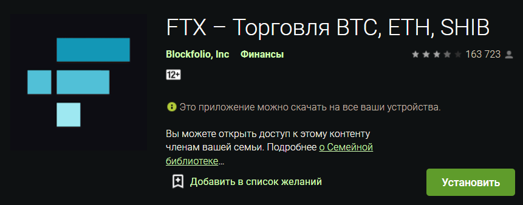
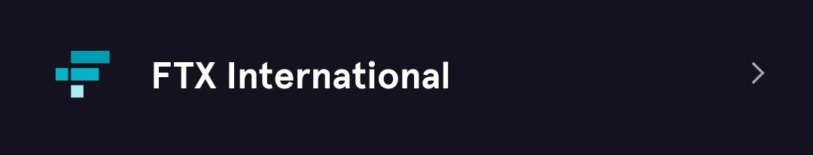

# Рассылка токенов в сети ERC-20 с нулевой комиссией
- [оригинальная статья](https://telegra.ph/ERC20-za-0-perevody-11-21)

## Введение
Кошелек Blockfolio позволяет выводить криптовалюту в сеть ERC-20 без комиссий! Именно этим мы и воспольземся для рассылки наших токенов по эфировским кошелькам.

## Регистрация кошелька Blockfolio
- Скачиваем кошелек на телефон или эмулятор: [GooglePlay](https://play.google.com/store/apps/details?id=com.blockfolio.blockfolio) , [App-Store](https://apps.apple.com/ru/app/ftx-%D1%80%D0%B0%D0%BD%D0%B5%D0%B5-blockfolio/id1095564685)

- Регистрируем международный (International) кошелек Blockfolio.

- Чтобы снять лимиты на ввод/вывод криптовалюты, проходим легкую KYC верификацию, где указываем данные паспорта, адрес (заполняем данные на латинице) и номера телефона.

## Пополнение кошелька Blockfolio
Кошелек Blockfolio можно пополнить множеством способов, но, в целях экономии средств, мы используем следующие два:
- Депозитим криптовалюту в USDC ERC-20 токенах [биржи FTX](https://ftx.com/ru) вовсе без комиссий.
- Допозитим криптовалюту в USDT TRC-20 или BEP-20 токенах c комиссией в ~1$ минуя биржу FTX

## Рассылка токенов
- Выводим с Blockfolio криптовалюту в сети ERC-20 на нужные кошельки и радуемся сэкономленному ужину в ресторане!