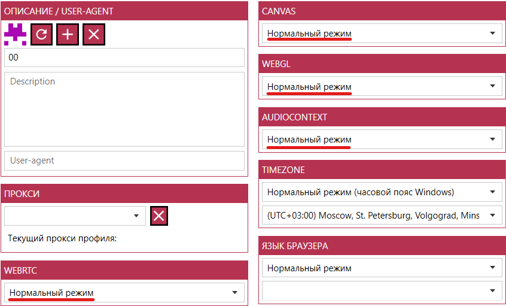
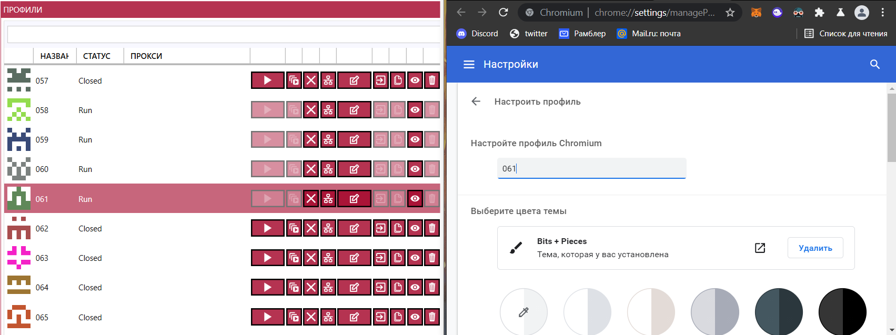
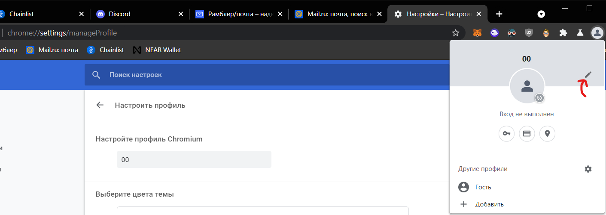
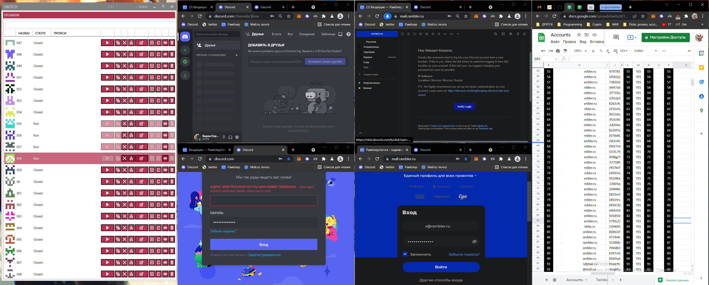
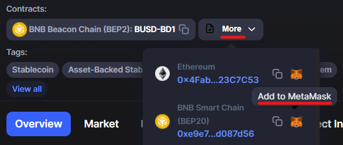

# Инструкция по созданию фермы аккаунтов без прокси на бесплатном антидетект-браузере SWITCH
Это оригинальная статья

---

## Преимущества SWITCH перед Google Chrome
Создание фермы на бесплатном антидетект-браузер SWITCH имеет несколько преимуществ, которые делают держание фермы в профилях обычного Google Chrome бессмысленным.

-> [Все о покупке аккаунтов для фермы](Абузы%20и%20мультиакинг.md)

### Удобство хранения и способа запуска аккаунтов
Держание фермы аккаунтов в виде профилей Google Chrome приводит к тому, что основные рабочие профили смешиваются с профилями фермы. К тому же Google Chrome не показывает, какие профили уже запущены, a массовый запуск трудозатратнее, чем в антидетект-браузере, где можно просто проклацать кнопки запуска.

### Клонирование профилей
Клонирование профилей Google Chrome производится посредством копирования папки с профилем, которая по каким-то причинам копируется безмерно долго, в то время, когда в антидедект-браузере клонирование происходит всего несколько секунд с помощью нажатия одной кнопки.

### Функции антидетект-браузера, как приятный бонус
Хоть мы и не задействуем возможности антидетект-браузера на полную (использование прокси и подмена отпечатков), никто не запрещает нам использовать их в будущем и вывести ферму на новый уровень.

### Сохранение профилей
Очень удобно, что мы можем импортировать наши профили и экспортировать их в любой момент для работы на другом компьютере.

## Установка и настройка SWITCH
Регистрация, установка и настройка данного антидетект браузера не займет много времени.

## Недостатки и баги SWITCH
По каким-то причинам у меня не работает почта mail.ru.

Также постоянно вылетают рандомные ошибки при закрытии профилей, что, к счастью, никак не влияет на работу.

### Регистрация и установка
1. Регистрируемся на [официальном сайте разработчика mybot.su](http://mybot.su/register.php).
2. [Скачиваем SWITCH](http://mybot.su/switch).
3. Устанавливаем на компьютер и логинимся.

Программа распространается бесплатно и имеет закрытый код, и я не могу ручаться за ее безопасность. Берегите свои данные!

### Расположение файлов профилей
По умолчанию SWITCH сохранаяет профили по пути: `C:\Users\Username\AppData\Local\Temp` .
Каждый профиль весит 200+ мегабайт, а мы не хотим нагружать свой диск C.
К тому же мы хотим знать, где храняться наши профили, чтобы за ними было проще следить.

Переходим в настройки программы и указываем новый путь сохранения профилей:

## Настройка профиля-заготовки
Нам нужно сделать эталонный профиль, который мы далее будем клонировать и заполнять данными фермы.

### Создаем профиль
Создаем профиль. В полях, относящихся к антидетект-настройкам, ставим нормальный режим, ведь наc не интересуют эти функции и мы не используем прокси:

### Настройки браузера
Переходим в [Настройки браузера -> Внешний вид -> Запуск Chrome](chrome://settings/appearance) и выбираем пункт Ранее открытые вкладки:

Также можно [поставить темную тему браузера](https://chrome.google.com/webstore/category/themes).

### Закладки
Закрепляем нужные закладки:
- [Near Wallet](https://wallet.near.org/)
- [Chainlist](https://chainlist.org/)
- [Discord](https://discord.com/channels/@me)
- [Twitter](https://twitter.com/home)
- [Почта Маил](https://account.mail.ru/login)
- [Почта Рамблер](https://mail.rambler.ru/)

### Стартовые вкладки
Можно указать имя пользователя профиля, совпадающее с названием профиля в списке профилей антидетект-браузера:

Из заранее открытых вкладок можно открыть вкладку настроек профиля, чтобы при запуске нового профиля можно было сразу задать ему желаемое имя:

### Расширения
Устанавливаем нужные расширения:
 - [Metamask](https://chrome.google.com/webstore/detail/metamask/nkbihfbeogaeaoehlefnkodbefgpgknn)
 - [Phantom wallet](https://chrome.google.com/webstore/detail/phantom/bfnaelmomeimhlpmgjnjophhpkkoljpa)
- [Polkadot.js](https://chrome.google.com/webstore/detail/polkadot%7Bjs%7D-extension/mopnmbcafieddcagagdcbnhejhlodfdd)
 - [Dark Reader](https://chrome.google.com/webstore/detail/dark-reader/eimadpbcbfnmbkopoojfekhnkhdbieeh) (темная тема)
 - [uBlock Origin](https://chrome.google.com/webstore/detail/ublock-origin/cjpalhdlnbpafiamejdnhcphjbkeiagm) (блокировка рекламы)
 - [DuckDuckGo](https://chrome.google.com/webstore/detail/duckduckgo-privacy-essent/bkdgflcldnnnapblkhphbgpggdiikppg)
 - [Google Переводчик](https://chrome.google.com/webstore/detail/google-translate/aapbdbdomjkkjkaonfhkkikfgjllcleb)
- [Антикапча](https://anti-captcha.com/clients/settings/apisetup) 
-> [Гайда по установки расширения](../Инструменты/Расширение%20для%20браузера%20AntiCaptcha.md)
- VPN

## Создание фермы
Остается только клонировать профиль-заготовку, задать ему номер, зайти в него и войти в нужные аккаунты и кошельки:

### Настройка метамаска
Заранее добавляем в метамаск нужные сети с помощью [chainlist](https://chainlist.org/):
- Polygon
- Binance Smart Chain

Заранее добавляем в метамаск нужные токены с помощью [coinmarketcap](https://coinmarketcap.com/):
- [busd](https://coinmarketcap.com/currencies/binance-usd/)
- [usdt](https://coinmarketcap.com/currencies/tether/)
- [usdc](https://coinmarketcap.com/currencies/usd-coin/)

