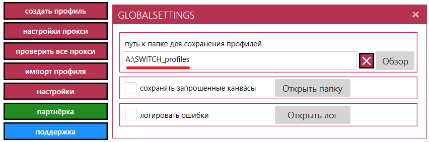
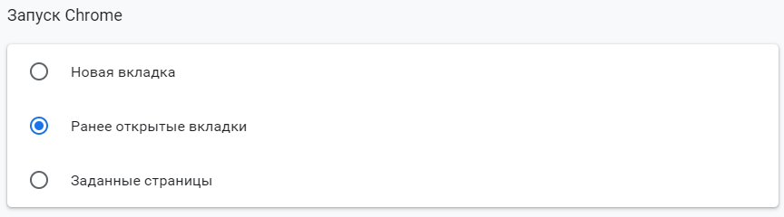
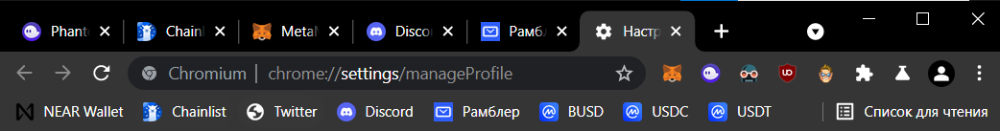
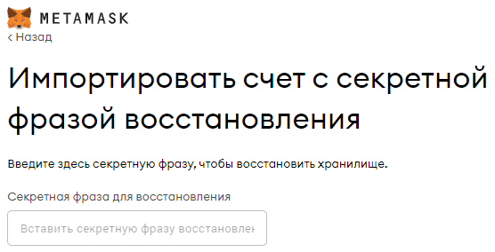

# Инструкция по созданию фермы аккаунтов без прокси на бесплатном антидетект-браузере SWITCH
Это оригинальная статья

---

## Преимущества SWITCH перед Google Chrome
Создание фермы на бесплатном антидетект-браузер SWITCH имеет несколько преимуществ, которые делают держание фермы в профилях обычного Google Chrome бессмысленным.

-> [Все о покупке аккаунтов для фермы](Абузы%20и%20мультиакинг.md)

### Удобство хранения и способа запуска аккаунтов
Держание фермы аккаунтов в виде профилей Google Chrome приводит к тому, что основные рабочие профили смешиваются с профилями фермы. К тому же Google Chrome не показывает, какие профили уже запущены, a массовый запуск трудозатратнее, чем в антидетект-браузере, где можно просто проклацать кнопки запуска.

### Клонирование профилей
Клонирование профилей Google Chrome производится посредством копирования папки с профилем, которая по каким-то причинам копируется безмерно долго, в то время, когда в антидедект-браузере клонирование происходит всего несколько секунд с помощью нажатия одной кнопки.

### Функции антидетект-браузера, как приятный бонус
Хоть мы и не задействуем возможности антидетект-браузера на полную (использование прокси и подмена отпечатков), никто не запрещает нам использовать их в будущем и вывести ферму на новый уровень.

### Сохранение профилей
Очень удобно, что мы можем импортировать наши профили и экспортировать их в любой момент для работы на другом компьютере.

## Установка и настройка SWITCH
Регистрация, установка и настройка данного антидетект браузера не займет много времени.

## Недостатки и баги SWITCH
Постоянно вылетают рандомные ошибки при закрытии профилей, что, к счастью, никак не влияет на работу.

### Регистрация и установка
1. Регистрируемся на [официальном сайте разработчика mybot.su](http://mybot.su/register.php).
2. [Скачиваем SWITCH](http://mybot.su/switch).
3. Устанавливаем на компьютер и логинимся.

Программа распространается бесплатно и имеет закрытый код, и я не могу ручаться за ее безопасность. Берегите свои данные!

### Расположение файлов профилей
По умолчанию SWITCH сохранаяет профили по пути: `C:\Users\Username\AppData\Local\Temp` .
Каждый профиль весит 200+ мегабайт, а мы не хотим нагружать свой диск C.
К тому же мы хотим знать, где храняться наши профили, чтобы за ними было проще следить.

Переходим в настройки программы и указываем новый путь сохранения профилей:

К сожалению, по каким-то причинам профили-клоны все равно сохраняются по стандартному пути `C:\Users\Username\AppData\Local\Temp` даже после изменения настроек.

## Настройка профиля-заготовки
Нам нужно сделать эталонный профиль, который мы далее будем клонировать и заполнять данными фермы.

### Создаем профиль
Создаем профиль. В полях, относящихся к антидетект-настройкам, ставим нормальный режим, ведь наc не интересуют эти функции и мы не используем прокси:

### Настройки браузера
Переходим в [Настройки браузера -> Внешний вид -> Запуск Chrome](chrome://settings/appearance) и выбираем пункт Ранее открытые вкладки:

Также можно [поставить темную тему браузера](https://chrome.google.com/webstore/category/themes).

### Закладки

Закрепляем нужные закладки:
- [Near Wallet](https://wallet.near.org/)
- [Chainlist](https://chainlist.org/)
- [Twitter](https://twitter.com/home)
- [Discord](https://discord.com/channels/@me)
- Почта ([Рамблер](https://mail.rambler.ru/), [Gmail](https://mail.google.com/mail/u/0/#inbox))
- [WAX Wallet](https://wallet.wax.io/dashboard)
- [AtomicHub](https://wax.atomichub.io/trading)
- [PancaceSwap](https://pancakeswap.finance/swap)
- [QuickSwap](https://quickswap.exchange/#/swap)
- [OpenSea](https://opensea.io/account)
- [ApeBoard](https://apeboard.finance/dashboard)
- [PooCoin](https://poocoin.app/)
- Вкладки [CoinMarketCap](https://coinmarketcap.com/) с частоиспользуемыми токенами ([busd](https://coinmarketcap.com/currencies/binance-usd/), [usdt](https://coinmarketcap.com/currencies/tether/), [usdc](https://coinmarketcap.com/currencies/usd-coin/)), чтобы можно было быстро импортировать их в Metamask в случае надобности:

### Расширения

Устанавливаем нужные расширения:
 - [Metamask](https://chrome.google.com/webstore/detail/metamask/nkbihfbeogaeaoehlefnkodbefgpgknn)
 - [Phantom wallet](https://chrome.google.com/webstore/detail/phantom/bfnaelmomeimhlpmgjnjophhpkkoljpa)
- [Polkadot.js](https://chrome.google.com/webstore/detail/polkadot%7Bjs%7D-extension/mopnmbcafieddcagagdcbnhejhlodfdd)
 - [Dark Reader](https://chrome.google.com/webstore/detail/dark-reader/eimadpbcbfnmbkopoojfekhnkhdbieeh) (темная тема)
 - [uBlock Origin](https://chrome.google.com/webstore/detail/ublock-origin/cjpalhdlnbpafiamejdnhcphjbkeiagm) (блокировка рекламы)
 - [DuckDuckGo](https://chrome.google.com/webstore/detail/duckduckgo-privacy-essent/bkdgflcldnnnapblkhphbgpggdiikppg)
 - [Google Переводчик](https://chrome.google.com/webstore/detail/google-translate/aapbdbdomjkkjkaonfhkkikfgjllcleb)
- [Антикапча](https://anti-captcha.com/clients/settings/apisetup) 
-> [Гайд по установке расширения](../Инструменты/Расширение%20для%20браузера%20AntiCaptcha.md)
- VPN

### Стартовые вкладки
Открываем следующие вкладки заранее, чтобы нам не приходилось открывать их при запуске каждого нового профиля-клона:
1. [Настройки профиля](chrome://settings/manageProfile), чтобы в первую очередь указать желаемое имя пользователя.
Лучше всего указывать имя пользователя, совпадающее с именем профиля в списке профилей антидетект-браузера:

2. Используемая для входа в Discord почта ([Рамблер](https://mail.rambler.ru/), [Gmail](https://mail.google.com/mail/u/0/#inbox)).
3. [Discord](https://discord.com/login)
4. [Twitter](https://twitter.com/)
5. Меню импорта мнемонической фразы в Metamask:

5. [Chainlist](https://chainlist.org/), чтобы сразу добавить желаемые сети (Polygon, Binance Smart Chain) в Metamask.
6. Меню импорта мнемонической фразы в Phantom Wallet.
7. Меню импорта мнемонической фразы в [Near Wallet](https://wallet.near.org/recover-seed-phrase).

## Создание фермы
Остается только клонировать профиль-заготовку, задать ему номер, зайти в него и войти в нужные аккаунты и кошельки:

