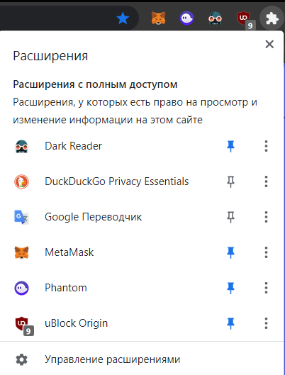

# Инструкция по созданию фермы аккаунтов без прокси на бесплатном антидетект-браузере SWITCH
- Это оригинальная статья.
---

## Преимущества SWITCH перед Google Chrome
Создание фермы на бесплатном антидетект-браузер SWITCH имеет несколько преимуществ, которые делают держание фермы в профилях обычного Google Chrome бессмысленным.

-> [Все о покупке аккаунтов для фермы](Абузы%20и%20мультиакинг.md).

##### Удобство хранения и способа запуска аккаунтов
Держание фермы аккаунтов в виде профилей Google Chrome имеет следующий недостаток: основные рабочие профиля смешиваются с профилями фермами, что неудобно. К тому же в Google Chrome не показывается, какие профили уже запущены, a массовый запуск немного трудозатратнее, чем в антидетект-браузере, где можно просто проклацать кнопки запуска.

##### Клонирование профилей
Клонирование профилей Google Chrome сложнее, чем в антидетект-браузере. Это производится посредством копирования папки с профилем, которая по каким-то копируется безмерно долго. 

В антидедект-браузере клонирование происходит всего несколько секунд с помощью нажатия одной кнопки.

##### Функции антидетект-браузера, как приятный бонус
Хоть мы и не задействуем возможности антидетект-браузера на полную (использование прокси и подмена отпечатков), никто не запрещает использовать их в будущем и вывести ферму на новый уровень.

##### Сохранение профилей
Очень удобно, что мы можем импортировать наши профили и экспортировать их в любой момент для работы на другом компьютере.

## Установка SWITCH
- Регистрируемся на [официальном сайте разработчика mybot.su](http://mybot.su/register.php):

- [Скачиваем SWITCH с официального сайта](http://mybot.su/switch):

- Устанавливаем на компьютер и логинимся.

Программа распространается бесплатно и имеет закрытый код, а я не могу ручаться за ее безопасность. Берегите свои данные!

## Настройка профиля-заготовки
Нам нужно сделать эталонный профиль, который мы далее будем клонировать и заполнять данными фермы.

### Создаем профиль
Создаем профиль. В полях, относящихся к антидетект-настройкам, ставим нормальный режим, ведь наc не интересуют эти функции и мы не используем прокси:

Запускаем профиль. Можно указать имя пользователя профиля, совпадающее с названием профиля в списке профилей антидетект-браузера:

### Закладки
Закрепляем нужные закладки:
    - [Chainlist](https://chainlist.org/)
	- [Discord](https://discord.com/channels/@me)
	- [Twitter](https://twitter.com/home)
	- [Почта Маил](https://account.mail.ru/login)
	- [Почта Рамблер](https://mail.rambler.ru/)	

### Расширения
Устанавливаем нужные расширения:

    - [Metamask](https://chrome.google.com/webstore/detail/metamask/nkbihfbeogaeaoehlefnkodbefgpgknn)
    - [Phantom wallet](https://chrome.google.com/webstore/detail/phantom/bfnaelmomeimhlpmgjnjophhpkkoljpa)
    - [Dark Reader](https://chrome.google.com/webstore/detail/dark-reader/eimadpbcbfnmbkopoojfekhnkhdbieeh) (темная тема)
    - [uBlock Origin](https://chrome.google.com/webstore/detail/ublock-origin/cjpalhdlnbpafiamejdnhcphjbkeiagm) (блокировка рекламы)
    - [DuckDuckGo](https://chrome.google.com/webstore/detail/duckduckgo-privacy-essent/bkdgflcldnnnapblkhphbgpggdiikppg)
    - [Google Переводчик](https://chrome.google.com/webstore/detail/google-translate/aapbdbdomjkkjkaonfhkkikfgjllcleb)
	
#### Антикапча
Антикапча поможет нам каждый раз не решать сотню капч вручную при открытии сотни профилей:
    - В первую очередь [регистрируемся на сайте](https://anti-captcha.com/clients/entrance/login) и вносим средства для оплаты решения капч.
	- Скачиваем [ZIP-расширение с официального сайта](https://antcpt.com/rus/download/google-chrome-options/manual-zip.html):
	
	- Распаковываем архив в папку:
	
	- Переходим в управление расширениями:
	
	- Включаем режим разработчика и загружаем распакованное расширение:
	
	- Переходим в [аккаунт AntiCaptcha -> settings -> API setup](https://anti-captcha.com/clients/settings/apisetup) и копируем API-ключ:
    
	- Переходим в настройки расширения AntiCaptcha и вставляем в полу скопированный ключ, нажимаем сохранить:
	

## Создание фермы
- Остается только клонировать профиль-заготовку, задать ему номер, зайти в него и войти в нужные аккаунты и кошельки:

- Заранее добавляем в метамаск нужные сети с помощью [chainlist](https://chainlist.org/):
    - Binance Smart Chain
    - Polygon

- Заранее добавляем в метамаск нужные токены с помощью [coinmarketcap](https://coinmarketcap.com/):
    - [busd](https://coinmarketcap.com/currencies/binance-usd/)
    - [usdt](https://coinmarketcap.com/currencies/tether/)
    - [usdc](https://coinmarketcap.com/currencies/usd-coin/)
